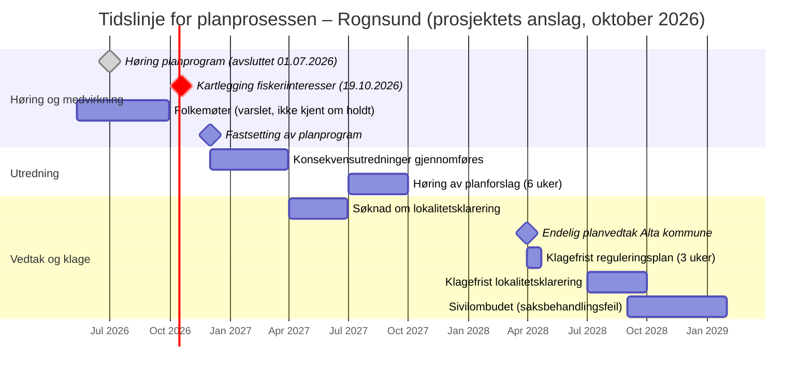

# Ta vare på Rognsund – langsiktig bærekraft for fjorden

> *«Vi arver ikke Rognsundet av våre foreldre, vi låner det av våre barn. Den arven plikter vi å levere tilbake i minst like god – og helst enda bedre – forfatning. Målet er ikke å stoppe noen, men å sikre fjordens langsiktige bærekraft: en levende villaksstamme, en uberørt nasjonalpark, rene fellesarealer og en trygg sjøsamisk fremtid. Alt som skal skje i Rognsundet, må gjøre fjorden bedre – ikke fattigere.»*

**Den overordnede målsetningen er langsiktig bærekraft for Rognsund – økologisk, kulturelt og økonomisk, på kort og lang sikt. Dette dokumentet er en respons på SalMar Farming AS' kunngjøring om utvidet akvakultur i Rognsundet (Alta kommune): det forklarer saken, måler planen mot bærekraftmålet (FNs – De forente nasjoners – bærekraftmål), og viser hvordan man kan påvirke prosessen slik at utfallet blir positivt for fjorden. Målet er ikke å stoppe SalMar for enhver pris – men intet bør gjennomføres som ikke gjør Rognsund bedre. Alt bygger på offentlig tilgjengelige dokumenter og etterprøvbare kilder.**

> **Status oktober 2026:** Høringen av planprogrammet ble avsluttet **01.07.2026** – innspillet som ble sendt, ligger i [`Innspill/`](Innspill/README.md).  
> **Nå:** Rambøll kartlegger fiskeriinteresser i Rognsund – **frist 19.10.2026**. Se [momenter til inspirasjon](Innspill/Kartlegging_fiskeriinteresser.md).  
> **Neste:** Alta kommune skal avgjøre om planprogrammet fastsettes (normalfristen var ca. 09.09.2026). Kommunen kan stanse saken ved ikke å fastsette det, eller stille krav til utredningene. Se **[Veien videre](VEIEN-VIDERE.md)** for prosessen steg for steg, verifisert lovgrunnlag og påvirkningsmuligheter.

---

## Om dette dokumentet

Den **overordnede målsetningen er langsiktig bærekraft for Rognsund** – for villaksen, naturmangfoldet, den sjøsamiske kulturen, fisket, friluftslivet og lokalsamfunnet, både på kort og lang sikt. Å stoppe SalMars utvidelse er ikke et mål i seg selv; det er én mulig konsekvens dersom planen ikke tjener denne bærekraften.

Dette dokumentet er en **respons på SalMars kunngjøring om detaljregulering for akvakultur i Rognsund** ([Rambøll, 11.05.2026](https://www.ramboll.com/no-no/kunngjoring-rognsund-akvakultur)) og det tilhørende underlaget i `underlag/` (varslingsbrev, planinitiativ, oppstartsmøtereferat og planprogram). Det er ment som en **forklaring og en oppskrift**: hvordan planen måles mot bærekraftmålet, hvordan man påvirker prosessen – og dersom noe skal gjennomføres, hvordan man sikrer at det faktisk blir **positivt for Rognsund**, ikke bare skadefritt.

SalMar Farming AS har varslet oppstart av detaljregulering (pbl. – plan- og bygningsloven – §12-8) for å etablere to nye lokaliteter i Rognsundet, samtidig som 2–3 av de fem eksisterende lokalitetene (i dag til sammen 15 300 tonn) «kan» fjernes. SalMar «vurderer» at samme biomasse kan produseres på færre lokaliteter, men det er ikke foreslått noe bindende tak. Planutvalget i Alta kommune vedtok **enstemmig oppstart** av planarbeidet 04.12.2025 (sak 50/2025) – men *oppstart* er ikke det samme som *godkjenning*. Det endelige vedtaket er politisk, og prosessen kan påvirkes – og stoppes – på flere punkter.

> **Se `PLAN-SAMMENSTILLING.md` for den fullstendige faglige gjennomgangen (23 kapitler).** Denne README-en er handlingsdelen: argumentene satt i system, med konkrete steg, frister og mottakere.

---

## Målet: et bærekraftig Rognsund over tid

Dette prosjektet har ett overordnet mål: **et bærekraftig Rognsund over tid.** Ikke et Rognsund uten næringsaktivitet, men et fjordsystem der havbruk, villaks, sjøsamisk kultur, tradisjonelt fiske, reiseliv og friluftsliv kan eksistere side om side – også for kommende generasjoner.

Da er spørsmålet ikke bare *hvor* nye anlegg plasseres, men *hvordan* de drives, *hvor mye* de slipper ut, og om driftsformen er forenlig med Rognsunds tålegrense på lang sikt. SalMars plan måles mot dette – ikke mot et ønske om å være mot næringen.

| Dimensjon | Hva som må sikres over tid |
|-----------|----------------------------|
| **Økologisk** | Villaks (Altavassdraget), vannkvalitet, bunn, truede arter, hval/sjøpattedyr, verneområder |
| **Sosialt/kulturelt** | Sjøsamisk kultur og fiske, lokalsamfunn (butikk, skole, ferge), friluftsliv |
| **Økonomisk** | Levedyktig verdiskaping og arbeidsplasser – innenfor naturens tålegrense |

Av dette følger to mulige utfall – og begge tjener det samme målet:

**1. Planen gjøres positiv for Rognsund → da kan den være et gode.** Dersom tiltaket omarbeides slik at fjorden kommer *bedre* ut enn i dag – lukket teknologi, lavere samlet belastning, gamle anlegg fjernet, bindende garantier – kan utvidelsen forene næring og natur. Vilkårene står i «Dersom noe skal gjennomføres» nedenfor.

**2. Planen tjener ikke bærekraften → den bør ikke gjennomføres slik den foreligger.** Slik den nå er beskrevet (åpne merder, begge lokalitetene i strid med kommuneplanens arealdel – den sørlige i FFNFA (fellesområde for fiske, ferdsel, natur, friluftsliv og akvakultur, der oppdrett av anadrome arter ikke er tillatt), mangelfullt kunnskapsgrunnlag), trekker planen i feil retning. Da er det legitimt – og nødvendig – å stoppe den. Verktøyene står i «Oppskrift» nedenfor.

Forskjellen ligger i **SalMars intensjon**: er viljen til stede for å gjøre dette på den riktige måten – med teknologi og bindende garantier som gjør fjorden bedre – kan utvidelsen bli et gode for Rognsund. **Er den viljen ikke til stede, er det viktig at prosjektet stoppes.** Poenget er ikke utfallet for SalMar, men utfallet for Rognsund.

---

## Direkte svar til SalMars kunngjøring

Kunngjøringen er profesjonelt utformet. Målt mot bærekraftmålet er det likevel flere formuleringer som bør møtes med presise motsvar – ikke for å være vanskelig, men for å sikre at planen vurderes på riktig grunnlag:

| SalMar/Rambøll sier | Realiteten – og hva du bør svare |
|---------------------|----------------------------------|
| «På bakgrunn av teknologisk utvikling, fiskehelse og fokus på miljøpåvirkning …» | Motivasjonen presenteres som miljøforbedring, men **driftsformen forblir åpne merder**. Ingen lukket teknologi loves. Krev at lukket/semilukket teknologi utredes på lik linje. |
| «… samtidig som 2-3 mindre egnede lokaliteter **kan** fjernes» | «Kan», ikke «skal». Det finnes **ingen juridisk binding** for at noe faktisk fjernes. Krev rekkefølgebestemmelse: nye lokaliteter kan ikke tas i bruk før de gamle er permanent avviklet. |
| «Summen av SalMars akvakulturanlegg … skal altså ikke øke» | En **intensjon uten mekanisme**. Gjelder dessuten bare *SalMars* anlegg – ikke Kime Akvas torskeoppdrett – og nasjonalt utredes nye reguleringsmodeller som kan endre dagens MTB-system (se «Nasjonalt regelverk i endring»). Krev et **absolutt, bindende tak** på samlet biomasse i sundet. |
| «… ønsker innspill … på en **mer nøyaktig plassering** … innenfor sirklene» | Dette forsøker å snevre debatten til *hvor*. Du står fritt til å gi innspill på **om** planen bør gjennomføres og **hvordan** (driftsform, FFNFA-forbudet, KU (konsekvensutredning)-omfang) – ikke bare hvor innenfor sirklene. |
| «… ble oppstart av planarbeidet **enstemmig vedtatt**» | Dette gjaldt kun **oppstart**, ikke godkjenning. Det endelige vedtaket er politisk og kan stemmes ned; statlige myndigheter og Sametinget kan fremme **innsigelse**. |
| Plasseringen (planinitiativet) | Alta kommune har i oppstartsmøtereferatet krysset av for at planinitiativet **«STRIDER med overordnet/gjeldende plan»**. Nord er i hovedsak avsatt til fiske (VFI2); sør ligger i FFNFA, der oppdrett av anadrome fiskearter (laks og ørret) ikke er tillatt (KPA – kommuneplanens arealdel – pkt. 6.2.2). Avviket må begrunnes særskilt og er et tungt politisk og planfaglig argument. Det er ikke et absolutt rettslig forbud – en ny plan går foran eldre plan (pbl § 1-5) – men SalMar kan ikke kreve kommunestyrebehandling hvis kommunen velger ikke å fremme et planforslag som avviker fra KPA (pbl § 12-11). Se [Veien videre](VEIEN-VIDERE.md). |

---

## Oppskrift: slik kan vi påvirke prosessen

Dette er kjernen i dokumentet: hvordan du kan påvirke saken slik at utfallet tjener Rognsund – herunder å stoppe planen dersom den ikke gjør fjorden bedre. Stegene er sortert etter gjennomslagskraft.

### Steg 1 (avsluttet 01.07.2026): Høringsinnspill til planprogrammet
> **Status:** Høringsfristen er passert. Innspillet som ble sendt, ligger i [`Innspill/`](Innspill/README.md) og kan gjenbrukes ved høring av planforslaget (2027). **Nå (frist 19.10.2026):** svar på Rambølls [kartlegging av fiskeriinteresser](Innspill/Kartlegging_fiskeriinteresser.md) – planprogrammet legger opp til at kunnskapen om fiske hentes inn gjennom slik dialog, uten befaring.

Høringen av planprogrammet var den **første og viktigste muligheten**. Planprogrammet bestemmer hva som skal utredes; det som ikke tas inn her, blir sjelden utredet senere. Send innspill til Rambøll (marie.mcdougall@ramboll.no) **med kopi** til Alta kommune, Statsforvalteren, Sametinget og Kystverket. Bygg innspillet på de tre tyngste punktene:

1. **FFNFA-forbudet (KPA – kommuneplanens arealdel – §6.2.2):** Krev at den sørlige lokaliteten tas ut, og at motstrid med overordnet plan avklares før prosessen fortsetter.
2. **Kunnskapsmangel + føre-var (nml. – naturmangfoldloven – §9):** Krev at kjemisk tilstand, reelle strømmålinger, fugl, marinarkeologi og truede arter kartlegges *før* planprogrammet fastsettes.
3. **Driftsform:** Krev at lukket/semilukket/landbasert teknologi utredes på lik linje med åpne merder.

(Se den detaljerte momentlisten og innspillsmalen lenger ned.)

### Steg 2: Få sektormyndighetene til å fremme innsigelse – det sterkeste virkemidlet
En **innsigelse** (pbl. §5-4) fra en statlig/regional myndighet eller Sametinget gjør at kommunen ikke kan egengodkjenne planen. Uløst innsigelse går til mekling hos Statsforvalteren og kan til slutt avgjøres av Kommunal- og distriktsdepartementet. De mest aktuelle:

- **Statsforvalteren i Troms og Finnmark** – villaks, naturmangfold, vannforskriften, FFNFA. **Høyest innsigelsespotensial.**
- **Sametinget** – sjøsamisk område; konsultasjonsplikt og kulturminner.
- **Kystverket** – hvit lyktesektor (Mjånes fyr) kan være et absolutt hinder.
- **Fiskeridirektoratet** – gyteområder og kystflåtens fiskefelt.
- **NVE** (Norges vassdrags- og energidirektorat) – skred- og flodbølgefare.

**Hva du gjør:** Skriv direkte til disse (gjerne kopi av høringsinnspillet) og be dem konkret vurdere innsigelse. Gi dem dokumentasjonen de trenger – pek på FFNFA, villaks, vannforskriften og kunnskapshullene.

### Steg 3: Påvirk det politiske vedtaket i Alta kommune
Planen krever til slutt **politisk flertall** i kommunestyret. Lokaldemokratiet er derfor avgjørende:

- Kontakt folkevalgte og partigrupper; be om at saken behandles i lys av FFNFA, villaks og føre-var.
- Folkemøter var varslet «i løpet av varslingsperioden» (mai–juli 2026). Undersøk om de er holdt; hvis ikke, be om folkemøte i bygdene før planprogrammet fastsettes og før konsekvensutredningene. Møt opp og gjør motforestillingene synlige.
- Bruk **lokale medier** (Altaposten, iFinnmark, NRK – Norsk rikskringkasting) til å løfte saken.
- Mobiliser **bygdelag, fiskarlag, hytteforeninger og reinbeitedistrikter** – bredde teller politisk.

### Steg 4: Krev reell konsultasjon (sameloven kap. 4)
Hele Rognsundet er sjøsamisk område. Manglende eller mangelfull konsultasjon er en **saksbehandlingsfeil** som kan stoppe eller forsinke planen. Be om konsultasjon via Alta kommune (sameloven § 4-4). Kapittel 4 har ingen egen klageordning, men brudd på konsultasjonsreglene «kan gi grunnlag for ugyldighet» (§ 4-9) og kan påberopes i klage over planvedtaket. Sametinget kan fremme innsigelse (pbl § 5-4).

### Steg 5: Bruk innsyn og dokumentasjon offensivt
Be om innsyn (offentleglova § 3, jf. § 28) i all korrespondanse mellom SalMar, Rambøll og kommunen. Innsyn avdekker forutsetninger og svakheter, og dokumenterer prosessen for en eventuell klage.

### Steg 6: Konsesjonsrunden – en ny mulighet selv om reguleringsplanen vedtas
Reguleringsplanen gir **ikke** i seg selv rett til drift. Ny lokalitet krever **lokalitetsklarering (akvakulturtillatelse) fra Finnmark fylkeskommune**, som samordner sektormyndighetene: Mattilsynet (fiskehelse og dyrevelferd), Statsforvalteren (utslippstillatelse etter forurensningsloven), Kystverket (havne- og farvannsloven) og vertskommunen. Dette er **egne prosesser** med egne innspills- og klagemuligheter. Mattilsynet har tidligere stoppet prosjekter av hensyn til villaks.

### Steg 7: Klage – og om nødvendig rettslig prøving
Etter vedtak: **klagefrist 3 uker** – klage på reguleringsplan behandles av Statsforvalteren, klage på lokalitetsklarering fra fylkeskommunen av Fiskeridirektoratet, og klage på utslippstillatelse av Miljødirektoratet. Saksbehandlingsfeil kan i tillegg klages inn for Sivilombudet. Organisasjoner som Naturvernforbundet kan vurdere rettslig prøving ved lovbrudd.

> **Den lange linjen:** Et nei i én runde er sjelden endelig, og et ja kan stoppes i neste. Hold dokumentasjonen oppdatert, følg opp vedtak og frister, og hold lokalsamfunnet informert. Regionalt finnes fortilfeller – bl.a. organisert motstand mot oppdrett i Porsangerfjorden (2026).

---

## Dersom noe skal gjennomføres: det må være positivt for Rognsund

Dersom aktivitet skal gjennomføres, er kravet ikke bare at den unngår skade, men at den gjør **Rognsund bedre enn i dag** – et netto gode for fjorden. Følgende vilkår må være oppfylt og **juridisk bindende før vedtak**:

1. **Lukket eller semilukket teknologi** – ny/utvidet drift kun med teknologi som dokumentert reduserer lus, rømming og utslipp vesentlig (oppsamling av slam, vanninntak under lusebeltet). Åpne merder videreføres ikke.
2. **Rekkefølgebestemmelse** – nye lokaliteter kan ikke tas i bruk før de lokalitetene som skal utgå, er **permanent avviklet**, fortøyninger fjernet og akvakulturformålet tatt ut av kommuneplanen. SalMar har ikke sagt hvilke 2–3 lokaliteter som skal fjernes – det må avklares og bindes i planen. (Lille Kufjord og Store Kvalfjord har visningstillatelser knyttet til Laksens hus.) SalMars eget planinitiativ sier at det «framstår som hensiktsmessig å styre eventuell avvikling gjennom rekkefølgebestemmelser i reguleringsplanen».
3. **Netto lavere belastning enn i dag** – bindende reduksjon i samlet biomasse og utslipp i sundet, ikke bare et tak på dagens nivå, og medregnet Kime Akvas torskeoppdrett (kumulative effekter, nml. §10).
4. **Kunnskap før vedtak** – kjemisk tilstand, reelle strømmålinger, fugl, marinarkeologi og truede arter kartlagt før planprogrammet fastsettes (føre-var, nml. §9).
5. **FFNFA respekteres** – ingen anadrom oppdrett i FFNFA-området (sør) uten at motstrid med overordnet plan er reelt avklart.
6. **Aktiv forbedring av fjorden** – tiltaket bidrar positivt, f.eks. opprydding av eksisterende bunnpåvirkning, restaurering av avviklede lokaliteter og bidrag til overvåking og styrking av villaksen.
7. **Reell overvåking og åpenhet** – baseline etter NS 9410:2016 (miljøovervåking av bunnpåvirkning fra marine akvakulturanlegg), lakselus på vill fisk (NALO – Nasjonalt overvåkingsprogram for lakselus på vill laksefisk) og DNA (deoksyribonukleinsyre)-overvåking av rømt fisk ved Altaelvas innløp, med offentlig rapportering.
8. **Reversibilitet** – tillatelser tidsbegrenses og kan trekkes ved brudd, slik at fjorden kan tilbakeføres.

> Dette er terskelen for at en utbygging faktisk gjør Rognsund bedre. Blir den ikke møtt, tjener ikke planen bærekraftmålet, og bør ikke vedtas slik den foreligger.

---

## Det grunnleggende spørsmålet: åpne merder og utslipp

Saken om Rognsund handler om mer enn plassering av to nye lokaliteter. Den handler om **driftsformen** – tradisjonelle åpne merder i sjø, der næringssalter, organisk materiale, lakselus, legemiddelrester og eventuelle rømlinger går rett ut i det åpne fjordvannet uten rensing.

### Utslipp av næringssalter og organisk materiale («kloakk»)

I åpne merder slippes fôrrester, fiskeavføring og urin ut direkte i sjøen. Omfanget er stort: ifølge en analyse fra **Sunstone Institute**, omtalt i VG i mai 2026, slapp norsk oppdrettsnæring i 2025 ut anslagsvis **75 000 tonn nitrogen, 13 000 tonn fosfor og 360 000 tonn organisk karbon**. Omregnet tilsvarer nitrogenutslippet urenset kloakk fra rundt **17 millioner mennesker** (17,2 millioner personekvivalenter), og fosforutslippet fra om lag 20 millioner. Langs deler av kysten anslås næringen å stå for **3–5 ganger** så store næringssaltutslipp som hele den menneskelige befolkningen i området.

> **Presisering (faglig redelighet):** Tallene gjelder hele Norge, ikke Rognsund spesifikt, og «17 millioner mennesker» er en *omregnet ekvivalent* for nitrogenmengde – ikke bokstavelig kloakk. Næringen og enkelte fagmiljøer kan bestride metodikk og lokal relevans. Men prinsippet er ubestridt: åpne merder har **ingen oppsamling** av utslipp, og den lokale belastningen avhenger av fjordens strøm og tålegrense. I Rognsund er nettopp **kjemisk tilstand ukjent** og **strømdata kun modellert** – vi vet altså ikke sikkert hvor mye fjorden faktisk tåler. Kilder: [VG (2026)](https://www.vg.no/nyheter/i/JOnvVm/som-om-17-millioner-mennesker-gjoer-fra-seg-rett-i-havet-nye-tall-om-utslippene-fra-norsk-fiskeoppdrett), [Aftenposten (2026)](https://www.aftenposten.no/norge/i/9pBPkr/utslipp-fra-oppdretten-tilsvarer-urenset-kloakk-fra-17-millioner-mennesker).

### Lakselus
Havforskningsinstituttets risikorapport for 2026 ([HI: Risikorapport norsk fiskeoppdrett 2026](https://www.hi.no/hi/nettrapporter/rapport-fra-havforskningen-2026-10)) viser rekordvekst i produksjonen fra 2024 til 2025, og at 67 millioner oppdrettslaks gikk tapt i 2025 – over 54 millioner døde i merdene ([TU, 2026](https://www.tu.no/artikler/ny-rapport-over-54-millioner-laks-dode-i-merdene-i-fjor/568141)). Ifølge omtalen avtar lakselusrisikoen nordover, men den er fortsatt høyere for beitende sjøørret og sjørøye, og risikoen for ny genetisk innkryssing fra rømt oppdrettslaks er moderat til høy i store deler av landet ([iLaks, 2026](https://ilaks.no/arets-risikorapport-fra-havforskningsinstituttet-hoyest-dodelighet-i-produksjonsomrade-3-og-4)).

For Rognsund er bildet sammensatt: produksjonsområde 12 (PO12 – Vest-Finnmark, som omfatter Altafjorden) fikk igjen **grønt lys** i trafikklyssystemet 19.06.2026, med tilbud om inntil 6 % kapasitetsvekst ([regjeringen.no](https://www.regjeringen.no/no/aktuelt/ny-fargelegging-i-trafikklyssystemet-for-havbruk/id3167021/)). Vurderingen bygger på lakselus i 2024 og 2025. Det er et reelt poeng som tiltakshaver vil vektlegge. Samtidig er grønt lys et *regionalt gjennomsnitt* som ikke fanger opp lokale, kumulative effekter i ett enkelt sund, ikke dekker utslipp, rømming eller andre arter, og ikke gir noen garanti for fremtiden.

### Rømming og genetisk innkryssing
Åpne merder kan ikke fullt ut hindre rømming. Rømt oppdrettslaks som gyter i elver som Altaelva fører til genetisk innkryssing som svekker villaksens lokale tilpasning. Rømningsrisiko bør vurderes opp mot klimaframskrivninger med hyppigere ekstremvær.

### Kobber, legemidler og bunnpåvirkning
Kobberimpregnering av nøter, avlusningsmidler og andre legemidler tilføres fjorden fra åpne anlegg, og organisk materiale akkumuleres på bunnen under og rundt merdene. Baseline-målinger etter NS 9410 bør etableres før eventuell oppstart.

> **Kjernen i saken:** Alt dette er iboende egenskaper ved **åpne** merder. Det reiser et legitimt spørsmål som hører hjemme i konsekvensutredningen: *Er åpen merdteknologi i det hele tatt forenlig med et bærekraftig Rognsund over tid – eller bør ny og utvidet drift skje med teknologi som samler opp utslipp og stenger ute lus?*

---

## Alternativer for driftsform – og konsekvensene

Plansaken presenterer alternativer for *plassering* (nord/sør, ti sektorer), men ikke for *driftsform*. Det finnes i dag flere teknologiske alternativer, som Havforskningsinstituttet grupperer i fire hovedkategorier. En reell konsekvensutredning bør sammenligne disse – ikke bare ulike kartpunkter for samme åpne teknologi.

| Driftsform | Lakselus | Rømming | Utslipp | Modenhet / kostnad | Konsekvens for Rognsund |
|------------|----------|---------|---------|--------------------|-------------------------|
| **Åpne merder (dagens)** | Eksponert | Mulig | Slippes urenset ut | Moden, lavest kostnad | Fortsatt belastning på fjord, villaks og bunn |
| **Semilukket i sjø** | Redusert (vann fra dypet) | Redusert | Delvis oppsamling | Kommersielt tilgjengelig | Lavere, men ikke null, lokal belastning |
| **Lukket i sjø** | Tilnærmet eliminert | Sterkt redusert | Kan samle opp slam | Tilgjengelig (~10 typer i Norge), høyere capex/energi | Vesentlig lavere fjordbelastning |
| **Nedsenkbar** | Redusert (under lusebeltet) | Avhenger av løsning | Som åpen | Under utvikling | Reduserer lus, ikke utslipp |
| **Landbasert (RAS – recirculating aquaculture system)** | Eliminert | Eliminert i sjø | Renses/kontrolleres | Energi- og arealkrevende | Fjerner fjordbelastningen helt, flytter den til land |
| **Offshore / eksponert** | Lavere påslag | Krevende forhold | Spres i åpent hav | Umoden, dyr | Flytter belastning vekk fra sårbar fjord |

**Drøfting:** Lukkede og semilukkede anlegg i sjø pekes av Havforskningsinstituttet og Veterinærinstituttet på som teknologi som kan løse tre av næringens største utfordringer samtidig – **lus, rømming og utslipp** – ved å hente vann fra 20–30 meters dyp (under lusebeltet) og samle opp slam. Sjømat Norge erkjenner at lukket/semilukket produksjon «absolutt kan være en del av løsningen, men ikke alene». Ulempene er reelle: høyere investeringer, økt energibruk og fiskevelferdshensyn som må dokumenteres. Landbasert fjerner fjordpåvirkningen helt, men flytter areal- og energibelastningen til land. Ingen løsning er gratis – men i et **sårbart arktisk fjordsystem med nasjonal lakseelv** er nettopp dette avveiningen som må gjøres eksplisitt, ikke forbigått.

> **Innspillstips:** Krev at konsekvensutredningen sammenligner *driftsformer* (åpen vs. lukket/semilukket/landbasert), ikke bare plasseringer, og at et «lukket teknologi»-alternativ og nullalternativet utredes på lik linje med dagens åpne merder.

---

## Nasjonalt regelverk i endring (2025–2026)

Rognsund-planen utformes samtidig som rammene for norsk havbruk er under utredning.

- **Havbruksmeldingen** (Meld. St. 24 (2024–2025) «Fremtidens havbruk – Bærekraftig vekst og mat til verden») ble behandlet 12. juni 2025 (Innst. 525 S (2024–2025)). Forliket mellom Ap, Høyre, Sp, FrP, SV og Venstre **satte regjeringens forslag til ny reguleringsmodell på vent**. Stortinget ba regjeringen utrede flere modeller basert på faktisk miljøpåvirkning – regjeringens modell, Havbruksutvalgets forslag og dagens rammeverk – og sende dem på høring før Stortinget velger ([iLaks: forliket](https://ilaks.no/her-er-det-politiske-forliket-om-havbruksmeldingen/)).
- **Oppfølging 2026:** Nærings- og fiskeridepartementet har hentet inn innspill og utreder hvordan utslipp av lakselus reguleres mest effektivt, med luseavgift eller omsettbare kvoter ([regjeringen.no: innspill til oppfølgingen](https://www.regjeringen.no/no/aktuelt/fiskeri-og-havministeren-inviterer-til-innspillsmoter-om-fremtidens-havbruksregulering/id3159856/)). En **tapsavgift** for dødelighet og rømming er varslet utredet. En **miljøfleksibilitetsordning** (oktober 2025) lar oppdrettere bruke kapasitet som er nedjustert i trafikklyssystemet i lukkede anlegg eller med nullutslippsteknologi.
- **Trafikklyset 19.06.2026:** PO12 (Vest-Finnmark) fikk grønt lys og tilbud om inntil 6 % vekst ([regjeringen.no, 19.06.2026](https://www.regjeringen.no/no/aktuelt/ny-fargelegging-i-trafikklyssystemet-for-havbruk/id3167021/)). Vekst i de grønne områdene kan utgjøre om lag 8 300 tonn MTB. Norske Lakseelver, NJFF, Naturvernforbundet og Reddvillaksen sendte felles høringssvar om kapasitetsjusteringen ([PDF](https://naturvernforbundet.no/content/uploads/2026/08/29-26-Horingssvar_kapasitetsjustering_2026_NL_NJFF_Naturvernforbundet_Reddvillaksen.pdf)).

Dagens MTB- og trafikklyssystem gjelder inntil nytt regelverk eventuelt vedtas.

> **Relevans for Rognsund:** Når nasjonal politikk utreder regulering etter faktisk miljøpåvirkning og gir insentiver for lukket teknologi, bør en reguleringsplan og KU som skal stå i mange år **ta høyde for denne retningen** – ikke låses til åpen merdteknologi slik den drives i dag. Dette er et tungt, saklig argument for å kreve teknologivurdering allerede nå.

---

## Kort sjekkliste – det du kan gjøre nå

Oppskriften over er den strategiske oversikten. Denne sjekklisten er den personlige versjonen – konkrete ting hver enkelt kan gjøre, fra det enkle til det mer forpliktende:

1. **Sett deg inn i saken og spre kunnskap.** Les dokumentene i dette prosjektet, del dem, og snakk med naboer, bygdelag og foreninger. Jo flere som kjenner saken, desto sterkere står lokalsamfunnet.
2. **Svar på kartleggingen av fiskeriinteresser innen 19.10.2026.** Høringen av planprogrammet ble avsluttet 01.07.2026; nå er det Rambølls skjema om fiske som gjelder. Svarene blir i praksis kunnskapsgrunnlaget for KU-temaet tradisjonelt fiske. Se [momenter til inspirasjon](Innspill/Kartlegging_fiskeriinteresser.md). Høringsinnspillet i `Innspill/` kan gjenbrukes når planforslaget kommer på høring (2027).
3. **Krev driftsform og teknologi utredet.** Be om at KU sammenligner åpne merder med lukket/semilukket/landbasert teknologi, og at et «lukket teknologi»-alternativ utredes på lik linje. Dette er den mest direkte veien til et bærekraftig utfall.
4. **Be om at kunnskapshullene tettes før vedtak.** Kjemisk tilstand, reelle strømmålinger, fuglekartlegging, marinarkeologi og kartlegging av truede arter bør foreligge *før* planprogrammet fastsettes, jf. føre-var-prinsippet (naturmangfoldloven §9).
5. **Be om juridisk bindende garantier.** «Samme biomasse» og «bedre plassering» er i dag intensjoner. Krev rekkefølgebestemmelser som binder fjerning av gamle lokaliteter og et tak på samlet belastning i sundet.
6. **Be om konsultasjon (samiske/sjøsamiske interesser)** etter sameloven §4-4 – sendes til Alta kommune, ikke til Rambøll.
7. **Bruk innsynsretten.** Etter offentleglova § 3 (jf. § 28) kan du be om innsyn i alle saksdokumenter, inkludert korrespondanse mellom SalMar, Rambøll og kommunen.
8. **Bygg allianser.** Naturvernforbundet, NJFF (Norges Jeger- og Fiskerforbund), FNF (Forum for Natur og Friluftsliv), reinbeitedistriktene, bygdelag og fiskarlag står sterkere sammen. Regionalt finnes fortilfeller – blant annet organisert motstand mot oppdrett i Porsangerfjorden (2026).
9. **Engasjer deg i hele prosessen, ikke bare nå.** Det kommer flere anledninger: fastsetting av planprogrammet (politisk behandling), kommunens beslutning om å sende planforslaget på høring, høring av planforslag (2027), vedtak og klage og egen behandling av lokalitetsklarering hos Finnmark fylkeskommune (med Mattilsynet, Statsforvalteren og Kystverket). Reguleringsvedtaket er ikke det eneste stoppunktet.
10. **Hold den lange linjen.** Målet er ikke å vinne én høring, men å sikre at Rognsund forvaltes bærekraftig over generasjoner. Dokumentér, følg opp vedtak, og hold lokalsamfunnet informert.

---

## Sentrale problemstillinger i planen

### 1. Villaks – Altaelva er nasjonalt laksevassdrag
Altavassdraget er et **nasjonalt laksevassdrag** (ett av 52; i tillegg finnes 29 nasjonale laksefjorder, jf. St.prp. nr. 32 (2006–2007)). Ifølge SalMars planinitiativ har Vitenskapelig råd for lakseforvaltning satt tilstanden til **«moderat»** – under kvalitetsnormen (ikke uavhengig kontrollert her). Planinitiativet oppgir også at om lag **16 %** av den migrerende laksen fra Altavassdraget og Altafjorden bruker Rognsundet som vei til havet, basert på kartlegging 2016–2018 og med kildehenvisningen «Lakseklyngen, Havforsknings-instituttet, 2018». Planinitiativet erkjenner at Rognsundet er «en av vandringsrutene for anadrom fisk» fra Altavassdraget. Fangsten i Altaelva var 2 806 laks i 2025 ifølge [Norske Lakseelver](https://lakseelver.no/sites/default/files/Sesongen_2025.pdf).

> **⚠️ Kvalitetssikring av 16 %-andelen:** Tallet er SalMars egen gjengivelse. Originalkilden er ikke funnet; en Akvaplan-niva-rapport fra 2017, «Vill og oppdrettet laksefisk i Altafjorden» (Jensen, Strand m.fl.), er en mulig kilde, men det er ikke bekreftet. Krev at Rambøll legger fram full referanse og metode (smolt eller voksen laks, antall merkede fisk, år). Selv om bare en minoritet av laksen bruker sundet, er den en del av et nasjonalt laksevassdrag som allerede er under kvalitetsnormen.

**Viktig presisering:** Altafjorden er nasjonal laksefjord. Ifølge planinitiativet ligger Rognsundet utenfor den nasjonale laksefjorden (yttergrensen er ikke kontrollert mot primærkilde her). PO12 har grønt lys, og lakselusrisikoen vurderes som lavere i nord enn lenger sør – det er et reelt motargument tiltakshaver vil bruke. Grønt lys er likevel en regional vurdering som ikke fanger opp lokale og samlede effekter i ett enkelt sund, ikke dekker utslipp og rømming, og ikke gir garanti for fremtiden – særlig når grønt lys gir vekst i hele produksjonsområdet. Også Repparfjordelva ligger innenfor 60 km influensområde.

> **HIs risikorapport 2026:** Lakselusrisikoen avtar nordover, men er fortsatt høyere for sjøørret og sjørøye; risikoen for ny genetisk innkryssing fra rømt oppdrettslaks er moderat til høy i store deler av landet (gjengitt i [iLaks](https://ilaks.no/arets-risikorapport-fra-havforskningsinstituttet-hoyest-dodelighet-i-produksjonsomrade-3-og-4)). Lakselus på vill laksefisk overvåkes gjennom NALO (Nasjonalt overvåkingsprogram for lakselus på vill laksefisk). [HI: Risikorapport norsk fiskeoppdrett 2026](https://www.hi.no/hi/nettrapporter/rapport-fra-havforskningen-2026-10)

### 2. FFNFA – forholdet til kommuneplanens arealdel
Kommuneplanens arealdel (2021–2040, vedtatt 15.02.2021) pkt. 6.2.2 angir at oppdrett av anadrome fiskearter (laks og ørret) ikke er tillatt i FFNFA (fellesområde for fiske, ferdsel, natur, friluftsliv og akvakultur). Den sørlige lokasjonen ligger i FFNFA-område, og den nordlige i et område som i hovedsak er avsatt til fiske (VFI2). Planinitiativet sier selv at tiltaket er «i strid med gjeldende planstatus», og kommunen har i oppstartsmøtereferatet krysset av for at planinitiativet *«STRIDER med overordnet/gjeldende plan»*.

### 3. Kunnskapsgrunnlagets tilstrekkelighet
Flere sentrale forhold er ikke tilstrekkelig kartlagt per i dag:
- Kjemisk tilstand i Rognsundet er **ukjent** – vanskeliggjør vurdering etter vannforskriften §12
- Kulturminner i sjø er **ukjent/lavt** – tre ulike myndigheter involvert
- **Fuglekartlegging** er ikke gjennomført. Planprogrammet forutsetter befaring med fuglekartlegging (og ROV-kartlegging av havbunnen), men overlater feltsesongen til fagutreder. Kartleggingen bør skje i hekkesesongen (krykkje, lunde, ærfugl m.fl.).
- **Strømdata** foreligger kun som modellering, ikke faktiske målinger
- **Kartlegging av truede arter** har hvite flekker
- Naturmangfoldloven §9 (føre-var-prinsippet) kan komme til anvendelse

### 4. Vannforskriften §12 – vilkår for ny aktivitet
Rognsundet har i dag **god økologisk status**, men **ukjent kjemisk tilstand**. Uten dokumentert kjemisk tilstand er det krevende å vurdere om vannforskriften §12 (ny aktivitet som kan forringe tilstanden) er oppfylt. Dette er et sentralt utredningstema.

### 5. Metodisk uenighet om konsekvensutredning
Det er dokumentert **faglig uenighet** om KU-metodikk. I oppstartsmøtet foreslo Alta kommune Miljødirektoratets veileder M-1941 for klima- og miljøtemaene og for samfunn og utvikling, mens planrådgiver foreslo V712 for tradisjonelt fiske og samfunn. Høringsutkastet til planprogram bruker V712 for tradisjonelt fiske, reindrift og befolkning og samfunn. Ifølge planprogrammet er metodene «svært like», men V712 åpner «i større grad» for konsekvensvurderinger uten feltarbeid. Ulik metode kan gi ulike konklusjoner, og dette bør avklares før utredningsarbeidet starter.

### 6. Seiland nasjonalpark – visuell påvirkning
Anleggene kan bli synlige fra topper og høyder i Seiland nasjonalpark. Kommunen har bedt om 3D-modell og visualiseringer for å vurdere visuell påvirkning på nasjonalparkens verneverdier. Verneformålet omfatter alpin landsform og opplevelseskvaliteter.

### 7. Truede arter og gyteområder
Området har registreringer av flere rødlistede fuglearter, blant annet krykkje og lunde (sterkt truet, EN), ærfugl, gråmåke og tyvjo (sårbar, VU) og storskarv (nær truet, NT) – kategorier ifølge Artskart-uttrekket i PLAN-SAMMENSTILLING kap. 5.2. (Planprogrammet kaller alle disse «truede», men NT er ikke en truet kategori.) Det er også registrert gyteområder for torsk ved Sanden, Nordbukta og Store Kufjord. To hotspots for truede arter på land (Mjånes og Kremmervika/Daudingsberget), primært karplanter, er identifisert i planinitiativet.

**Bunntilstand:** HI-data viser at eksisterende akvakulturanlegg i Finnmark stort sett har «meget god» bunntilstand, men nye anlegg på hardbunn med lite tidligere tilførsel kan gi mindre dokumenterte effekter. Baseline-målinger etter NS 9410 bør etableres før oppstart.

**Undervannsstøy:** Støy fra anlegg (fôrflåter, fortøyninger, båttrafikk) kan påvirke sjøpattedyr og fisk. Dette bør utredes i KU, gjerne med sertifiserte akustikere.

### 8. Samiske interesser og reindrift
To reinbeitedistrikter berøres (24A Oarje-Sievju og 25 Stierdná). Konsultasjonsplikt etter sameloven §4-4 kan utløses. Sjøsamisk bosetting og tradisjonelt fiske må utredes særskilt. Sametingets planveileder gjelder ut til 1 nautisk mil. Hele Rognsundet ligger i et sjøsamisk område.

### 9. Hvit lyktesektor – farled og sikkerhet
Mjånes fyrlykt har hvite sektorer som i utgangspunktet ikke tillater faste installasjoner. Rambølls vurdering er foreløpig – Kystverket må gi endelig uttalelse. Dette kan påvirke plassering av anleggene.

### 10. Hval og småhval i Altafjorden og Rognsund

Altafjorden er et internasjonalt kjent hvalområde, særlig i vinterhalvåret (slutten av oktober til slutten av januar) når store mengder sild trekker inn i fjordene. I tillegg til de store hvalartene finnes det **flere mindre, mer stedbundne småhvalarter** som oppholder seg i Rognsundet året rundt – noe som gjør dem særlig sårbare for lokal påvirkning.

**Store hvalarter (sesongbasert, følger sild):**
- **Spekkhogger** (*Orcinus orca*) – regelmessig observert i Altafjorden
- **Knølhval** (*Megaptera novaeangliae*) – regelmessig observert
- **Finnhval** (*Balaenoptera physalus*) – oftere i nærliggende områder som Kvænangsfjorden

**Småhvalarter (mer stedbundne, til stede hele året):**
- **Kvitnos** (*Lagenorhynchus albirostris*) – store mengder i Rognsund. En sosial delfinart som lever i grupper og er avhengig av gode lydforhold for kommunikasjon.
- **Nise** (*Phocoena phocoena*) – Norges minste hvalart, også til stede i Rognsund. Nise er særlig følsom for undervannsstøy og bruker ekkolokalisering til navigasjon og jakt.

Rognsundet er en del av Altafjordsystemet, og hval som beiter på sildestimene kan bevege seg gjennom eller oppholde seg i sundet. Flere lokale turoperatører (bl.a. Icecube of Aurora, Finnmark Moods, Holmen Husky, MS Kautokeino/Sami Experience) tilbyr hvalsafari fra Alta havn i vintersesongen.

**Relevans for planen:**
- **Undervannsstøy** fra akvakulturanlegg (fôrflåter, fortøyninger, båttrafikk) kan påvirke hvalenes atferd, kommunikasjon og beiting. Særlig nise er svært følsom for støy da den bruker ekkolokalisering. Støy fra anlegg bør utredes i KU, gjerne med sertifiserte akustikere.
- **Kumulative effekter** av økt aktivitet i Rognsundet (båttrafikk, anleggsaktivitet) kan påvirke hvalenes bruk av området.
- **Kollisjonsrisiko** mellom båttrafikk til/fra anlegg og hval bør vurderes.
- Fordi kvitnos og nise er **mer stedbundne** enn de store hvalartene, vil de kunne påvirkes gjennom hele året – ikke bare i vintersesongen. Dette bør tillegges vekt i vurderingen av kumulative effekter.
- Hval er langtrekkende arter som nyter særlig beskyttelse gjennom naturmangfoldloven og internasjonale avtaler (bl.a. CMS/Konvensjonen om trekkende arter). Nise er ikke vurdert som truet (livskraftig, LC), men er særlig følsom for undervannsstøy. Påvirkningen bør vurderes etter naturmangfoldloven §§ 8–10.

> **Innspillstips:** Be om at undervannsstøy og påvirkning på sjøpattedyr (inkludert hval, kvitnos og nise) utredes i konsekvensutredningen, med henvisning til naturmangfoldloven §§8–10.

### 11. Biomasse og kumulative effekter
Det er per i dag ikke foreslått juridisk bindende mekanismer som sikrer at total biomasse ikke øker utover dagens 15 300 tonn. Reguleringsplanen åpner for etablering – fremtidige endringer av kapasitet følger ordinære prosesser.

Kumulative effekter fra alle lokaliteter i Rognsundet, inkludert Kime Akvas torskeoppdrett, er ikke samlet utredet.

**Akvakulturloven § 10** krever at akvakultur «etableres, drives og avvikles på en miljømessig forsvarlig måte», og tillatelse kan bare gis når det er miljømessig forsvarlig (§ 6). Tillatelse kan ikke gis i strid med vedtatte arealplaner uten samtykke fra planmyndigheten (§ 15). Nye lokaliteter krever lokalitetsklarering fra Finnmark fylkeskommune, som innhenter vurderinger fra Mattilsynet, Statsforvalteren, Kystverket og kommunen – her kan naboer og interessenter sende uttalelser.

---

## Alternativer og plassering

Planen omfatter **tre alternativer** for plassering av to nye lokaliteter. To av alternativene velges, det tredje tas ut:

| Alternativ | Plassering | Beskrivelse |
|------------|-----------|-------------|
| **Nordvest** | Nordvestsiden av sundet | Ett anlegg |
| **Nordøst** | Nordøstsiden av sundet | Ett anlegg |
| **Sørøst** | Sørøstsiden av sundet | Ett anlegg |

SalMar er også åpen for **to anlegg i nord og ingen i sør**. Plasseringen er foreløpig kun basert på hvit lyktesektor fra Mjånes fyr – øvrige hensyn skal innarbeides gjennom konsekvensutredningene. Det er utarbeidet kart med **10 sektorer** for å få konkrete tilbakemeldinger.

> **Merk:** De nordlige områdene i Rognsund er mye brukte fiskefelt for kystflåten. Etablering av akvakulturanlegg i disse områdene kan komme i konflikt med tradisjonelt fiske og kystflåtens tilgang til fiskefeltene. Dette må utredes i konsekvensutredningen, og Fiskeridirektoratet bør gi uttalelse.

### Nullalternativet
Dersom planen ikke realiseres, beholdes dagens fem lokaliteter. Da forblir planstatus:
- **Nord:** Avsatt til fiske
- **Sør:** FFNFA (fellesområde for fiske, ferdsel, natur, friluft og akvakultur) – oppdrett av anadrome fiskearter ikke tillatt

Nullalternativet må utredes like grundig som planalternativene for å gi et reelt sammenligningsgrunnlag.

---

## Svakheter i planinitiativets §10-vurdering

Planinitiativet inneholder en vurdering etter forskrift om konsekvensutredninger §10 (kriterier for vesentlige virkninger). Flere av vurderingene er problematiske:

| Svakhet | Problem | Betydning |
|---------|---------|-----------|
| **Forhåndskonklusjon om nasjonalpark** | "Seiland nasjonalpark påvirkes ikke negativt" – konkludert uten utredning | Burde vært: "Kan ikke utelukkes før KU" |
| **Selvmotsigelse om vannkvalitet** | "Fastsatte mål for vannkvalitet er ikke overskredet" – samtidig som kjemisk tilstand er **ukjent** | Man kan ikke konkludere når data mangler |
| **Undervurdering av kumulative effekter** | Kun vurdert enkeltvis, ikke samlet belastning | Strider mot naturmangfoldloven §10 |
| **Manglende vurdering** | Skredfare er identifisert, men konsekvenser for infrastruktur er ikke vurdert | ROS-analysen (risiko- og sårbarhetsanalyse) må utvides |

> **Innspillstips:** Påpek disse svakhetene i ditt høringsinnspill – be om at §10-vurderingen oppdateres før planprogrammet fastsettes.

---

## Dokumenter i prosjektet

### Originale PDF-dokumenter

| # | Fil | Beskrivelse |
|---|-----|-------------|
| 1 | `underlag/D-bre-001 Varsel om oppstart Rognsund.pdf` | Formelt varsel om oppstart |
| 2 | `underlag/Kunngjøring_ Rognsund akvakultur - Ramboll - [www.ramboll.com].pdf` | Rambølls kunngjøring |
| 3 | `underlag/Varsel om oppstart av detaljregulering for akvakultur i Rognsund -_ - [www.alta.kommune.no].pdf` | Alta kommunes kunngjøring |
| 4 | `underlag/Vedlegg 1 - Planinitiativ.pdf` | Planinitiativ – 13 sider |
| 5 | `underlag/Vedlegg 2 - Oppstartsmøtereferat.pdf` | Møtereferat 22.01.2026 – 11 sider |
| 6 | `underlag/Vedlegg 3 - Planprogram.pdf` | **Hoveddokument** – Planprogram – 23 sider |
| 7 | `underlag/Vedlegg 4 - Personvernerklæring.pdf` | Personvernerklæring Rambøll |

### Konverterte markdown-filer

| # | Fil | Beskrivelse |
|---|-----|-------------|
| 1–7 | `underlag_konvertert/*.md` | Samme dokumenter som over, konvertert til lesbar markdown |
| 8 | `underlag_konvertert/Vedlegg 3 - Planprogram/` | HTML + 13 bilder fra planprogrammet |

### Kart og figurer

| Fil | Innhold |
|-----|---------|
| `underlag_bilder/*.png`, `*.jpg` | 20+ kartutsnitt, figurer og tabeller fra planmaterialet |

> **Merk:** For sitater og henvisninger, bruk de originale PDF-filene i `underlag/`. Markdown-filene er hjelpemidler for rask lesing og søk.

---

## Tidslinje for planprosessen

> **Om tidslinjen:** Planprogrammets egen fremdriftsplan (kap. 4.2) hadde medvirkningsmøter i 2.–3. kvartal 2026, fastsetting av planprogrammet i 3. kvartal 2026 og planvedtak i 2. kvartal 2027. Per 06.10.2026 er det ikke kjent at planprogrammet er fastsatt. Tidsrommene under er derfor prosjektets eget anslag. Skyves vedtaket til etter kommunevalget høsten 2027, er det et nytt kommunestyre som avgjør.

| Dato | Aktivitet | Mulighet for påvirkning |
|------|-----------|------------------------|
| 01.07.2026 | Frist for innspill til planprogram – ✅ avsluttet | Innspillet ligger i `Innspill/` og kan gjenbrukes senere |
| **19.10.2026** | **Kartlegging av fiskeriinteresser (Rambøll)** | Svar på skjemaet – se [momenter til inspirasjon](Innspill/Kartlegging_fiskeriinteresser.md) |
| 2.–3. kvartal 2026 (varslet) | Folkemøter i Rognsund – ikke kjent om de er holdt | Spør kommunen, og be om møte før planprogrammet fastsettes |
| Q4 2026 (planprogrammets plan: Q3 2026) | Planprogram fastsettes av Alta kommune – forsinket | Kontakt politikerne før behandlingen – se [Veien videre](VEIEN-VIDERE.md) |
| Q4 2026–Q1 2027 | Konsekvensutredninger gjennomføres | Meld interesse som informant for fiske, friluftsliv, reindrift. Fagutredere kontakter informanter særskilt |
| Q3 2027 | Høring av planforslag (minst 6 uker) | Ny høringsrunde – anledning til å kommentere hele planen |
| Q2 2027 | Søknad om lokalitetsklarering (Finnmark fylkeskommune, med Mattilsynet, Statsforvalteren og Kystverket) | Mulighet for uttalelse til søknaden |
| Q1 2028 (planprogrammets plan: Q2 2027) | Endelig planvedtak i Alta kommune | Klagefrist 3 uker etter vedtak til Statsforvalteren |
| Etter vedtak | Klagefrist lokalitetsklarering (3 uker) | Klagen sendes fylkeskommunen; Fiskeridirektoratet er klageinstans |
| Etter klagebehandling | Sivilombudet (ved saksbehandlingsfeil) | Kan vurdere formelle feil, men gir kun uttalelse |

### Klageveier – oversikt

| Klagegrunn | Klageinstans | Frist | Merknad |
|------------|-------------|:-----:|---------|
| **Reguleringsplanvedtak** | Statsforvalteren i Troms og Finnmark | 3 uker fra underretning eller kunngjøring | Vurderer formelle saksbehandlingsregler, lovtolkning. Faglig innhold endres sjelden |
| **Lokalitetsklarering / akvakulturtillatelse** (Finnmark fylkeskommune) | Fiskeridirektoratet | 3 uker | Klagen sendes fylkeskommunen. Kan argumentere mot miljøvilkår (vannmiljø, rømt fisk, lakselus) |
| **Vedtak fra Mattilsynet** (fiskehelse, dyrevelferd) | Mattilsynet (overordnet klageinstans) | 3 uker | Gjelder Mattilsynets eget vedtak/tillatelse |
| **Saksbehandlingsfeil** | Sivilombudet | Normalt innen ett år etter endelig vedtak | Gir kun uttalelse, ikke omgjøring. Kan likevel ha politisk tyngde |
| **Manglende konsultasjon** | Påberopes i klage over planvedtaket (Statsforvalteren) | 3 uker fra underretning eller kunngjøring | Sameloven kap. 4 har ingen egen klageordning; brudd «kan gi grunnlag for ugyldighet» (§ 4-9). Sametinget kan fremme innsigelse (pbl § 5-4) |
| **Utslippstillatelse** | Miljødirektoratet | Etter forurensningsloven | Gjelder ev. utslippstillatelse fra Statsforvalteren |

### Medvirkningsmuligheter – tre anledninger

| Anledning | Tidsrom | Hva kan du gjøre? |
|-----------|---------|-------------------|
| **1. Høring av planprogram** | 11.05–01.07.2026 | ✅ Avsluttet – innspillet ligger i `Innspill/` |
| **Kartlegging av fiskeriinteresser** | Frist 19.10.2026 | **Pågår nå** – svar på Rambølls skjema, se [momenter til inspirasjon](Innspill/Kartlegging_fiskeriinteresser.md) |
| **Folkemøter** | Varslet «i løpet av varslingsperioden» | Ikke kjent om de er holdt – spør kommunen |
| **Dialog med fagutredere** | Q4 2026–Q1 2027 | Meld deg som informant hvis du har kunnskap om fiske, friluftsliv, reindrift eller lokalsamfunn |
| **2. Høring av planforslag** | Q3 2027 | 6 ukers høring – ny mulighet for innspill |
| **3. Klage på vedtak** | Q1 2028 | 3 ukers frist fra underretning eller kunngjøring |

I tillegg kan du når som helst ta kontakt med plankonsulent (Rambøll) via e-post eller telefon.

**Sivilombudet:** Dersom du mener det har skjedd saksbehandlingsfeil (f.eks. manglende konsultasjon, brudd på saksbehandlingsregler), kan du klage til Sivilombudet. Sivilombudet gir kun uttalelse, ikke omgjøring, men uttalelsen kan ha politisk tyngde.

---

## Høringsinnspill – veiledning og momentliste

### Hvorfor sende innspill?

Planprogrammet fastsetter hvilke temaer som skal utredes i konsekvensutredningen. Dersom viktige temaer ikke tas med i planprogrammet, er det risiko for at de heller ikke blir tilstrekkelig utredet før planvedtak. **Jo flere som påpeker de samme manglene, desto større sjanse for at de blir tatt til følge.**

Alle kan sende innspill – privatpersoner, organisasjoner, lag og foreninger. Du trenger ikke juridisk eller faglig bakgrunn for å delta. Et innspill kan være kort og konsist, eller mer utfyllende – alt teller med i den samlede vurderingen.

### Hvordan be om konsultasjon (samiske interesser)

Hvis du representerer samiske eller sjøsamiske interesser, kan du be om konsultasjon etter **sameloven §4-4**. Dette sender du til Alta kommune, ikke til Rambøll:

> **Alta kommune, Planavdelingen**  
> E-post: postmottak@alta.kommune.no

Varselet sier: *"Representanter for samiske interesser bes melde inn behov for konsultasjon iht. sameloven kapittel 4 så snart som mulig, gjerne i forbindelse med dette varselet om oppstart av planarbeid. Dette gjelder både reindrift og andre samiske og sjøsamiske interesser."*

Konsultasjonsplikten omfatter både reindrift (distrikter 24A Oarje-Sievju og 25 Stierdná) og sjøsamiske interesser. Uenighet kan løftes til Kommunal- og distriktsdepartementet.

### Hvem sender du innspill til?

**Hovedmottaker:**
> **Rambøll Norge AS** v/Marie Dølør McDougall  
> E-post: marie.mcdougall@ramboll.no

Rambøll er planrådgiver for SalMar og skal sammenstille innspillene til kommunen. Innspillene blir del av det offentlige planmaterialet.

**Anbefalte kopimottakere** – for å sikre at innspillet også blir sett av dem som skal vurdere planen:
- **Alta kommune** (planmyndighet): postmottak@alta.kommune.no
- **Statsforvalteren i Troms og Finnmark** (innsigelsesmyndighet): sftfpost@statsforvalteren.no
- **Sametinget** (samiske interesser): samediggi@samediggi.no
- **Kystverket** (farleder og sikkerhet): post@kystverket.no

### Hva kan innspillet inneholde?

Et innspill kan ta opp ett eller flere temaer. Listen nedenfor gir forslag til temaer som fremstår som sentrale å få belyst, basert på gjennomgang av planmaterialet. Du kan velge å fokusere på det du selv er mest opptatt av eller har kunnskap om.

#### Forslag til temaer som bør utredes i konsekvensutredningen

1. **Villaks og lakselus** – Konsekvenser for Altaelva (nasjonal lakseelv) og Repparfjordelva. Rognsundet er en av vandringsrutene for anadrom fisk fra Altavassdraget (planinitiativet; Altafjorden har tre utløp: Stjernsundet, Rognsundet og Vargsundet). Lakselusmodellering for villaks bør gjennomføres. Be om at Rognsundet inkluderes i NALO-programmet (overvåkingsprogram for lakselus på vill fisk).
2. **Vannforskriften §12** – Kjemisk tilstand i Rognsundet er ikke kartlagt. Uten dette grunnlaget kan man ikke vurdere om vilkårene for ny aktivitet er oppfylt. Krev at kjemisk tilstand kartlegges **før** planprogrammet fastsettes.
3. **Sjøfugl** – Kartlegging i hekkesesong mangler, særlig for truede arter som krykkje, lunde og storskarv. Krev at fuglekartlegging gjennomføres før KU.
4. **Marinarkeologi** – Kunnskapsgrunnlaget for kulturminner i sjø er i dag ukjent/lavt. Marinarkeologisk befaring bør gjennomføres før planvedtak.
5. **Strømforhold** – Det foreligger kun modellerte strømdata, ikke faktiske målinger. Strømmen har betydning for spredning av partikler og lakselus. Krev reelle strømmålinger.
6. **Kumulative effekter** – Samlet belastning fra alle lokaliteter i Rognsundet (5 eksisterende + 2 nye + Kime Akvas torskeoppdrett) bør utredes samlet, jf. naturmangfoldloven §10.
7. **Fiskefelt for kystflåten** – De nordlige områdene i Rognsund er mye brukte fiskefelt for kystflåten. Etablering av anlegg kan fortrenge tradisjonelt fiske og hindre tilgang til viktige fiskefelt. Be om at konsekvenser for kystflåtens fiskefelt utredes, og at Fiskeridirektoratet gis anledning til å uttale seg.
8. **Seiland nasjonalpark** – Visuell påvirkning bør dokumenteres med 3D-modell og visualiseringer, slik kommunen har bedt om.
9. **Samiske interesser** – Konsultasjon etter sameloven §4-4 bør gjennomføres før planprogrammet fastsettes. Sjøsamisk fiske og reindrift (distrikter 24A og 25) må utredes særskilt.
10. **Metode for konsekvensutredning** – Alta kommune har anbefalt M-1941 (med feltarbeid) for flere tema, mens planrådgiver har foreslått V712. Krev at M-1941 brukes for **alle** KU-tema.
11. **Rømningsrisiko** – Bør vurderes opp mot klimaframskrivninger med økt frekvens av ekstremvær.
12. **Rekkefølgebestemmelse for biomasse** – Dersom planen skal sikre at total biomasse ikke overstiger dagens nivå, bør dette sikres gjennom en juridisk bindende rekkefølgebestemmelse.
13. **Nullalternativet** – Bør utredes like grundig som planalternativene, for å gi et reelt sammenligningsgrunnlag.
14. **FFNFA-forholdet** – Den sørlige lokasjonen ligger i FFNFA-område hvor oppdrett av anadrome fiskearter ikke er tillatt (KPA §6.2.2). Be om at dette avklares juridisk før planarbeidet fortsetter.
15. **Skredfare og flodbølge** – Registrert skred ved Hestneset/Hestneselva (2010). Be om at ROS-analysen vurderer konsekvenser for bebyggelse på land ved flodbølge.
16. **Eksisterende påvirkning** – Utslipp fra dagens fiskeoppdrett er vurdert til "liten grad" (2024), men kumulative effekter av eksisterende + nye anlegg er ikke vurdert. Be om oppdatert vurdering.
17. **Undervannsstøy og sjøpattedyr (hval, kvitnos, nise)** – Støy fra anlegg (fôrflåter, fortøyninger, båttrafikk) kan påvirke hval og andre sjøpattedyr. Altafjorden er et internasjonalt kjent hvalområde med spekkhogger, knølhval og finnhval, og Rognsund har store mengder kvitnos og nise. Be om at undervannsstøy og påvirkning på sjøpattedyr utredes i KU, jf. naturmangfoldloven §§8–10.
18. **Bunntilstand og baseline-målinger** – HI-data viser «meget god» bunntilstand ved eksisterende anlegg, men nye lokaliteter på hardbunn kan gi andre effekter. Be om baseline-målinger etter NS 9410 før oppstart.
19. **DNA-overvåking av rømt fisk** – Be om at det etableres DNA (deoksyribonukleinsyre)-overvåkingsprogram ved Altaelvas innløp for å dokumentere omfang av rømt oppdrettsfisk.

#### Innsynsbegjæringer – en annen måte å bidra på

Uavhengig av høringsinnspill kan du også be om innsyn i dokumenter etter **offentleglova § 3** (jf. § 28). Slike begjæringer bidrar til å sikre at all relevant informasjon kommer frem i lyset. Eksempel på formulering:

> *«I henhold til offentleglova § 3, jf. § 28, ber vi om innsyn i alle dokumenter knyttet til «Planinitiativ akvakultur Rognsund» i Alta kommune. Vi ber om elektronisk kopi av planinitiativ, planprogram, innrapporterte miljøundersøkelser og statistikkgrunnlag som er brukt i planarbeidet.»*

Send gjerne innsynsbegjæringen til Alta kommune (postmottak@alta.kommune.no) og/eller Mattilsynet.

#### Eksempel på hvordan et innspill kan formuleres

> **Tema: Konsekvenser for villaks**
>
> Jeg ønsker å påpeke at konsekvenser for villaks i Altaelva må utredes grundig. Altaelva er et nasjonalt laksevassdrag, og SalMars eget planinitiativ erkjenner at Rognsundet er en av vandringsrutene for anadrom fisk fra Altavassdraget. Økt lakseluspress fra nye anlegg kan påvirke bestanden negativt. Jeg ber om at full lakselusmodellering for villaks inngår i konsekvensutredningen.

> **Tema: Vannforskriften**
>
> Jeg er bekymret for at kjemisk tilstand i Rognsundet ikke er tilstrekkelig kartlagt. Uten dokumentert kjemisk tilstand er det vanskelig å vurdere om vannforskriften §12 er oppfylt. Jeg ber om at kjemisk tilstand kartlegges før planprogrammet fastsettes.

### Relevante problemstillinger for den videre planprosessen

#### Forholdet til kommuneplanens arealdel (KPA §6.2.2)
Den sørlige lokasjonen ligger i FFNFA-område, hvor kommuneplanens arealdel §6.2.2 angir at oppdrett av anadrome fiskearter ikke er tillatt. Dette reiser spørsmål om forholdet mellom reguleringsplan og overordnet plan som bør avklares tidlig i prosessen.

#### Metode for konsekvensutredning
Alta kommune har anbefalt M-1941 (med feltarbeid) for flere KU-tema, mens planrådgiver har foreslått V712. Valg av metode kan ha betydning for utredningens kvalitet og bør avklares før utredningsarbeidet starter.

#### Rekkefølgebestemmelse for biomasse
Dersom planen skal sikre at total biomasse ikke overstiger dagens nivå, kan en rekkefølgebestemmelse være aktuelt. Eksempel på formulering:
> "Nye lokaliteter i Rognsund kan ikke tas i bruk før de eksisterende lokalitetene [navngis i planen] er permanent avviklet, fortøyninger fjernet og akvakulturformålet i kommuneplanen endret til bruk og vern av sjø uten akvakultur (f.eks. ferdsel, fiske, natur og friluftsliv, jf. pbl § 11-7 nr. 6)."

#### Samisk konsultasjon
Sameloven §4-4 stiller krav om konsultasjon. Berørte reinbeitedistrikter (24A Oarje-Sievju og 25 Stierdná) og sjøsamiske rettighetshavere bør involveres i tråd med gjeldende regelverk.

#### Uavhengig faglig kvalitetssikring
For å sikre tillit til konsekvensutredningene kan det vurderes å innhente uavhengig faglig kvalitetssikring av sentrale utredningstemaer. Aktuelle fagmiljøer:
- **NINA** (Norsk institutt for naturforskning) – lakselus, villaks, økologi
- **Havforskningsinstituttet** – marine effekter, lakselusovervåking
- **NIVA** (Norsk institutt for vannforskning) – bunntilstand, vannkvalitet og næringssalter
- **UiT Norges arktiske universitet** – marin økologi, støy
- **UiT Norges arktiske universitet, campus Alta** (tidl. Høgskolen i Finnmark) – regionaløkologi og samfunn

---

## Aktører i planprosessen

Flere offentlige instanser har roller i planprosessen og kan fremme innsigelse dersom planen strider mot nasjonale eller regionale interesser:

| Aktør | Rolle i planprosessen | Vurdering |
|-------|-----------------------|:---------:|
| **Statsforvalteren i Troms og Finnmark** | Fremme innsigelse på miljø, naturmangfold, vannforskrift | **Høy** innsigelsesrisiko grunnet FFNFA og villaks |
| **Sametinget** | Konsultasjonsplikt, kan fremme innsigelse på samiske interesser | **Middels-Høy** – sjøsamisk område |
| **Kystverket** | Uttalelse om farleder, sikkerhet, Mjånes fyrlykt | **Middels** – hvit lyktesektor kan være hinder |
| **Fiskeridirektoratet** | Innsigelse på gyteområder og fiskeinteresser | **Middels** |
| **NVE** | Innsigelse på skredfare og flodbølgerisiko | **Middels** |
| **Mattilsynet** | Fiskehelse og lakselus | **Middels** |
| **Finnmark fylkeskommune** | Regional planmyndighet og kulturminner – og **vedtaksmyndighet for lokalitetsklarering** (akvakulturtillatelse) | **Middels-Høy** – avgjør konsesjonsrunden |
| **Sivilombudet** | Kan vurdere saksbehandlingsfeil (manglende konsultasjon, brudd på saksbehandlingsregler) | **Lav** – gir kun uttalelse, ikke omgjøring |
| **Alta kommune (kommunestyret; planutvalget forbereder saken)** | Fastsetting av planprogram og vedtak av reguleringsplan | Avgjørende – planen krever politisk flertall |
| **Naturvernforbundet / WWF (World Wide Fund for Nature) / FNF** | Høringsinnspill, ev. søksmål | Avhenger av organisasjonenes prioritering |
| **Reinbeitedistrikter** (24A, 25) | Samiske rettigheter, konsultasjonskrav | Kan påvirke prosess og fremdrift |
| **Lokale medier** (Altaposten, iFinnmark) | Offentlig debatt og informasjon | Viktig for allmennhetens kjennskap til saken |

---

## Nøkkelargumenter på én side

| Argument | Hvorfor det betyr noe | Juridisk grunnlag | Referanse |
|----------|----------------------|-------------------|-----------|
| **Villaks** | Altaelva = nasjonalt laksevassdrag. Ifølge planinitiativet bruker om lag 16 % av den migrerende laksen Rognsundet, og tilstanden er «moderat» (under kvalitetsnormen). PO12 har grønt lys, men det er en regional vurdering. Rognsundet ligger ifølge planinitiativet *utenfor* nasjonal laksefjord. | Nat.mangfoldloven §13, kvalitetsnorm | [LOV-2009-06-19-100](https://lovdata.no/dokument/NL/lov/2009-06-19-100), [HI 2026](https://www.hi.no/hi/nettrapporter/rapport-fra-havforskningen-2026-10) |
| **FFNFA-forbud** | KPA §6.2.2: Oppdrett av anadrome fiskearter er ikke tillatt i FFNFA. | KPA §6.2.2 | Alta kommune KPA 2021–2040 |
| **Kunnskapsmangel** | Kjemisk tilstand, fugl, kulturminner, strømdata – alt mangler. | Nat.mangfoldloven §9 (føre-var) | [LOV-2009-06-19-100 §9](https://lovdata.no/dokument/NL/lov/2009-06-19-100) |
| **Vannforskriften** | God okologisk status i dag. Kjemisk tilstand ukjent. §12 kan ikke dokumenteres. | Vannforskriften §§4 og 12 | [FOR-2006-12-15-1446](https://lovdata.no/dokument/SF/forskrift/2006-12-15-1446) |
| **Metodeuenighet** | Kommune vil ha M-1941 (feltarbeid), planrådgiver vil ha V712 (mindre felt). | KU-forskriften | Miljødir. M-1941, SVV V712 |
| **Nasjonalpark** | Seiland nasjonalpark (vernet 08.12.2006, 316 km²) – synlige anlegg kan svekke verneverdiene (alpint landskap og opplevelseskvalitet). | Naturmangfoldloven § 49 (utenforliggende virksomhet), jf. verneforskriften for Seiland nasjonalpark | [Seiland nasjonalparkstyre](https://nasjonalparkstyre.no/Seiland/verneomrader/seiland-sievju-nasjonalpark) |
| **Truede arter** | Krykkje og lunde (EN), ærfugl, gråmåke og tyvjo (VU), storskarv (NT) og villaks (NT) ifølge Artskart-uttrekket. Gyteområder for torsk. To hotspots for truede arter på land (primært karplanter). | Nat.mangfoldloven | [LOV-2009-06-19-100](https://lovdata.no/dokument/NL/lov/2009-06-19-100) |
| **Samiske rettigheter** | Konsultasjonsplikt. Sjøsamisk område. Kan forsinke eller stanse. | Sameloven §§4-4, 4-5 | [LOV-1987-06-12-56](https://lovdata.no/dokument/NL/lov/1987-06-12-56) |
| **Hvit lyktesektor** | Mjånes fyr – kan være absolutt hinder for plassering. | Havne- og farvannsloven | [LOV-2019-06-21-70](https://lovdata.no/dokument/NL/lov/2019-06-21-70) |
| **Skredfare** | Snøskred kan f.eks. utløse flodbølger. Registrert skred ved Hestneset i 2010. Steinsprangfare ved sørlig lokasjon. | Pbl (ROS-analyse) | [LOV-2008-06-27-71](https://lovdata.no/dokument/NL/lov/2008-06-27-71) |
| **§10-vurdering** | Planinitiativet har forhåndskonklusjoner og selvmotsigelser (ukjent = ikke overskredet). | KU-forskriften §10 | Forskrift om KU |
| **"Samme biomasse"** | Ingen juridisk garanti. Reguleringsplanen åpner bare for etablering. | Mangler rekkefølgebestemmelse | – |
| **Kumulative effekter** | 5+2 anlegg + torskeoppdrett = økt samlet belastning. Ikke utredet samlet. HI-data viser «meget god» bunntilstand ved eksisterende anlegg, men nye lokaliteter på hardbunn kan gi andre effekter. | Nat.mangfoldloven §10 | [LOV-2009-06-19-100 §10](https://lovdata.no/dokument/NL/lov/2009-06-19-100) |
| **Fiskefelt for kystflåten** | Nordlige områder i Rognsund er mye brukte fiskefelt. Anlegg kan fortrenge tradisjonelt fiske og hindre tilgang. | KPA, Fiskeridirektoratet | – |
| **Hval og sjøpattedyr** | Altafjorden er internasjonalt kjent hvalområde (spekkhogger, knølhval, finnhval). I tillegg store mengder kvitnos og nise i Rognsund – mer stedbundne og til stede hele året. Undervannsstøy og økt aktivitet kan påvirke atferd og beiting. | Nat.mangfoldloven §§8–10, CMS-konvensjonen | [LOV-2009-06-19-100](https://lovdata.no/dokument/NL/lov/2009-06-19-100) |
| **Driftsform og utslipp** | Åpne merder slipper ut næringssalter og organisk materiale urenset. Nasjonalt anslås utslippene å tilsvare kloakk fra ~17 mill. mennesker (nitrogen, 2025). Lokalt er kjemisk tilstand og strøm i Rognsund udokumentert. | Vannforskriften §12, nat.mangfoldloven §§9–10 | [VG 2026](https://www.vg.no/nyheter/i/JOnvVm/som-om-17-millioner-mennesker-gjoer-fra-seg-rett-i-havet-nye-tall-om-utslippene-fra-norsk-fiskeoppdrett) |
| **Lukket teknologi som vilkår** | Lukket/semilukket/landbasert teknologi kan redusere lus, rømming og utslipp vesentlig. KU bør sammenligne driftsformer, ikke bare plasseringer. | KU-forskriften, nat.mangfoldloven §12 (miljøforsvarlige teknikker) | HI/Veterinærinstituttet |
| **Regelverk i endring** | Forliket om havbruksmeldingen (2025) satte ny reguleringsmodell på vent; regjeringen utreder regulering etter faktisk miljøpåvirkning (luseavgift/kvoter, tapsavgift). Insentiver for lukket teknologi. Plan/KU bør ta høyde for retningen. | Meld. St. 24 (2024–2025), Innst. 525 S | [regjeringen.no](https://www.regjeringen.no/contentassets/341de502286746b7803860a2199aa3d6/no/pdfs/stm202420250024000dddpdfs.pdf) |
| **18 plantema** | Oppstartsmøtet listet 18 planfaglige tema etter KPA §1.11.1 som må vurderes, eventuelt utredes, og kommenteres i planbeskrivelsen. Flere kan bli nedprioritert uten innspill. | KPA §1.11.1 | Alta kommune KPA 2021–2040 |
| **Akvakulturloven** | § 10: akvakultur skal «etableres, drives og avvikles på en miljømessig forsvarlig måte». § 15: tillatelse kan ikke gis i strid med vedtatte arealplaner uten samtykke fra planmyndigheten. Lokalitetsklarering hos Finnmark fylkeskommune er en egen prosess i tillegg til reguleringsplanen. | Akvakulturloven §§ 6, 10, 15 | [LOV-2005-06-17-79](https://lovdata.no/dokument/NL/lov/2005-06-17-79) |
| **Kulturminneloven** | Automatisk fredete kulturminner i sjø må kartlegges. Norges arktiske universitetsmuseum (UiT, tidl. Tromsø Museum) forvalter kulturminner i sjø; Finnmark fylkeskommune og Sametinget er kulturminnemyndigheter på land. | Kulturminneloven | [LOV-1978-06-09-50](https://lovdata.no/dokument/NL/lov/1978-06-09-50) |
| **Reindriftsloven** | Varslingsplikt og vern av beiteområder. Kommunen må sikre reinbeitedistriktene særskilt vurdering. | Reindriftsloven | [LOV-2007-06-15-40](https://lovdata.no/dokument/NL/lov/2007-06-15-40) |

---

## Bakgrunn – dagens situasjon

SalMar driver i dag **fem lokaliteter** i Rognsundet (totalt 15 300 tonn MTB):

| Lokalitet | Kapasitet (tonn) |
|-----------|:----------------:|
| Pollen | 1 800 |
| Store Kvalfjord | 3 600 |
| Lille Kvalfjord | 2 700 |
| Lille Kufjord | 4 500 |
| Store Kufjord | 2 700 |

De ønsker å erstatte 2–3 av disse med to nye, bedre plasserte lokaliteter.

---

## Planprosess

Tidsrom er prosjektets anslag; planprogrammets egen plan hadde planvedtak i 2. kvartal 2027.

| Aktivitet | Tidsrom | Status |
|-----------|---------|--------|
| Planoppstart vedtatt av planutvalget | 04.12.2025 | ✅ Gjennomført (enstemmig) |
| Varsel oppstart og høring av planprogram | 11.05.2026 – 01.07.2026 | ✅ Avsluttet |
| Kartlegging av fiskeriinteresser (Rambøll) | høst 2026 – frist 19.10.2026 | **PÅGÅR** |
| Medvirkningsmøter og folkemøter | 2.–3. kvartal 2026 (planprogrammets plan) | Ikke kjent om de er holdt – spør kommunen |
| Fastsetting av planprogram | Q4 2026 (planprogrammets plan: Q3 2026) | Ikke kjent per 06.10.2026 – forsinket |
| Datainnsamling og konsekvensutredninger | Q4 2026 – Q1 2027 | Ikke gjennomført |
| Planforslag sendes kommunen | Q2 2027 | Ikke gjennomført |
| Høring og offentlig ettersyn (6 uker) | Q3 2027 | Ikke gjennomført |
| Sluttbehandling og planvedtak | Q1 2028 | Ikke gjennomført |

> **Merk:** Fremdriftsplanen er tentativ og kan påvirkes av saksbehandlingstid i kommunen, politiske møter og eventuelle uforutsette utfordringer.

---

## Kontaktinfo

### Plankonsulent (Rambøll)

Høringsfristen for planprogrammet gikk ut 01.07.2026. Plankonsulenten kan fortsatt kontaktes underveis i planprosessen:
> **Rambøll Norge AS**  
> Postboks 1077, 9503 Alta  
> E-post: marie.mcdougall@ramboll.no

Kontaktperson: **Marie Dølør McDougall** – tlf. +47 975 87 006

### Nøkkelpersoner i planprosessen

| Navn | Rolle | Kontakt |
|------|-------|---------|
| **Jens-Vidar Viken** | Kontaktperson SalMar Farming AS | jens-vidar.viken@salmar.no / 970 16 848 |
| **Marie Dølør McDougall** | Planfaglig konsulent, Rambøll | marie.mcdougall@ramboll.no / 975 87 006 |
| **Ingrid Holtan Fredriksen** | Saksbehandler, Alta kommune | postmottak@alta.kommune.no |
| **Veslemøy Grindvik** | Avdelingsleder plan, Alta kommune | postmottak@alta.kommune.no |
| **Synøve Jahr** | Arealplanlegger, Henning Larsen/Rambøll | – |

### Offentlige instanser – kontaktinfo

| Instans | Rolle | E-post | Telefon | Postadresse |
|---------|-------|--------|:-------:|-------------|
| **Alta kommune** | Planmyndighet | postmottak@alta.kommune.no | 78 45 50 00 | Postboks 1403, 9506 Alta |
| **Statsforvalteren i Troms og Finnmark** | Innsigelsesmyndighet (miljø, naturmangfold) | sftfpost@statsforvalteren.no | – | – |
| **Sametinget** | Samiske interesser, konsultasjon | samediggi@samediggi.no | – | – |
| **Kystverket** | Farleder, sikkerhet, Mjånes fyr | post@kystverket.no | – | – |
| **Fiskeridirektoratet** | Gyteområder, fiskeinteresser; klageinstans for lokalitetsklarering | post@fiskeridir.no | – | – |
| **Mattilsynet** | Fiskehelse, lakselus, dyrevelferd (vedtak før lokalitetsklarering) | postmottak@mattilsynet.no | – | – |
| **NVE** | Skredfare, flodbølgerisiko | nve@nve.no | – | – |
| **Miljødirektoratet** | KU-veileder M-1941, klage på utslipp | post@miljodir.no | – | – |
| **Nærings- og fiskeridepartementet (NFD)** | Havbruks- og konsesjonspolitikk, akvakulturloven | postmottak@nfd.dep.no | – | – |
| **Klima- og miljødepartementet (KLD)** | Overordnet miljø- og naturpolitikk | postmottak@kld.dep.no | – | – |
| **Riksantikvaren / Tromsø Museum** | Kulturminner i sjø | – | – | – |
| **Finnmark fylkeskommune** | Lokalitetsklarering (akvakulturtillatelse), kulturminner, regionale interesser | postmottak@ffk.no | – | – |
| **Kommunal- og distriktsdepartementet (KDD)** | Klageinstans konsultasjon (sameloven) | postmottak@kdd.dep.no | – | – |
| **Sivilombudet** | Saksbehandlingsfeil | postmottak@sivilombudet.no | – | – |
| **Datatilsynet** | Personvernklager | postkasse@datatilsynet.no | – | – |

### Politiske partier og folkevalgte

Reguleringsplanen avgjøres til slutt med **politisk flertall i Alta kommunestyre** (35 medlemmer; 11 partier representert i perioden 2023–2027). Posisjonen ledes av **Ap, Sp og Venstre**. Ordfører er Jan Martin Rishaug (Sp), som overtok etter Monica Nielsen (Ap) 29.09.2025 da Nielsen begynte å møte på Stortinget som vararepresentant. Å nå fram til partigruppene er derfor sentralt (jf. Steg 3 i oppskriften). Henvendelser kan også sendes samlet via postmottak@alta.kommune.no, merket med partigruppe.

**Gruppeledere i Alta kommunestyre** (slik de er oppført hos Alta kommune, oppdatert 27.05.2026)

| Parti | Gruppeleder |
|-------|-------------|
| **Arbeiderpartiet** (posisjon) | Ole Steinar Østlyngen |
| **Senterpartiet** (posisjon) | Jan Martin Rishaug |
| **Venstre** (posisjon) | Trine Noodt |
| **Høyre** | Alex Bjørkmann |
| **Fremskrittspartiet** | Claus Jørstad |
| **SV** | Tore Grøtte |
| **Rødt** | Britt Karin Søvik |
| **MDG** | Frode Elias Lindal |
| **Kristelig Folkeparti** | Knut Klevstad |
| **Konservativt** | Inger Svendsen |

*Kontaktinformasjon til gruppelederne står i [kommunens oversikt](https://www.alta.kommune.no/politikk/politiske-partier-i-kommunestyret). Private e-postadresser og telefonnumre gjengis ikke her.*

*Alta kommune oppgir at 11 partier er representert i perioden; de ti partigruppene med oppførte gruppeledere står over. Se [kommunens oppdaterte oversikt](https://www.alta.kommune.no/politikk/politiske-partier-i-kommunestyret) for den fullstendige listen (bl.a. om Pasientfokus, en stor lokal kraft i Alta, har representanter).*

> På nasjonalt nivå har særlig **SV og MDG** tatt til orde for strenge miljøkrav og lukket teknologi i havbruk, og **Rødt** er kritisk til åpne merder – men alle partigruppene bør kontaktes uavhengig av ståsted. Et bredt engasjement teller mest politisk.

**Finnmark fylkeskommune – politisk ledelse**

Fylkeskommunen er høringspart for regionale interesser og kulturminner, og den politiske ledelsen kan løfte saken regionalt.

| Rolle | Navn | Kontakt |
|-------|------|---------|
| **Fylkesordfører** | Hans-Jacob Bønå (H) | postmottak@ffk.no · 78 96 30 00 |

**Samiske og regionale politiske partier**

Hele Rognsundet er sjøsamisk område, og samiske politiske aktører er derfor særlig relevante – både direkte og via Sametinget (konsultasjon, jf. Steg 4).

| Parti / liste | Rolle | Kontakt |
|---------------|-------|---------|
| **Nordkalottfolket** | 15 av 39 mandater på Sametinget (valget 2025) og 7 mandater i Finnmark fylkesting (valget 2023, i flertallskoalisjon). Vektlegger kyst, sjøsamiske rettigheter og fiske | heia@nordkalottfolket.no · [nordkalottfolket.no](https://nordkalottfolket.no/kontakt/) |
| Nordkalottfolket – Sametinget | Parlamentarisk leder Vibeke Larsen | via [nordkalottfolket.no](https://nordkalottfolket.no/kontakt/) |
| Nordkalottfolket – Finnmark fylkesting | Gruppeleder Magne Ek | via [nordkalottfolket.no](https://nordkalottfolket.no/kontakt/) |
| **Norske Samers Riksforbund (NSR)** | Samepolitisk liste og organisasjon | [nsr.no](https://nsr.no/) |
| **Sametinget** | Sametingspresident Silje Karine Muotka (NSR), gjenvalgt 2025. Kan fremme innsigelse (pbl § 5-4) | samediggi@samediggi.no |

**Folkevalgte på Stortinget (Finnmark valgdistrikt, 2025–2029)**

Finnmark har fire stortingsrepresentanter. De er relevante for den nasjonale linjen, for havbruks- og konsesjonspolitikken og for å løfte saken i riksmediene. Fiskeri- og havministeren, Marianne Sivertsen Næss (Ap), er valgt fra Finnmark; Monica Nielsen (Ap) møter for henne.

| Representant | Parti | Kontakt / merknad |
|--------------|-------|-------------------|
| **Marianne Sivertsen Næss** | Ap | Fiskeri- og havminister; Monica Nielsen (Ap, ordfører i Alta 2015–2025) møter som vararepresentant fra 01.10.2025 |
| **Sigurd Kvammen Rafaelsen** | Ap | |
| **Bengt Rune Strifeldt** | FrP | |
| **Siren Julianne Jensen** | MDG | |

Kontaktinformasjon: [stortinget.no – representantene](https://www.stortinget.no/no/Representanter-og-komiteer/Representantene/).

> E-post til representantene følger normalt mønsteret fornavn.etternavn@stortinget.no, og kontaktinfo står på hver representants side. Generell vei inn: postmottak@stortinget.no · sentralbord 23 31 30 50.

### Medier

Mediedekning er avgjørende for at saken når ut. Lokalavisene kjenner Rognsund; riksmediene har løftet de nasjonale utslipps- og bærekraftspørsmålene (bl.a. «17-millioner»-saken i mai 2026); og fagmediene former næringsdebatten.

**Lokale og regionale medier**

| Medium | Rolle | Kontakt |
|--------|-------|---------|
| **Altaposten** | Lokalavis | redaksjonen@altaposten.no |
| **iFinnmark** | Lokalavis | redaksjonen@ifinnmark.no |
| **NRK Troms og Finnmark** | Distriktskontor | tromsfinnmark@nrk.no |

**Riksmedier** (for å løfte saken nasjonalt)

| Medium | Rolle | Kontakt (tips) |
|--------|-------|----------------|
| **VG** | Riksdekkende | 2200@vg.no · [vg.no/tips-oss](https://www.vg.no/tips-oss/) |
| **Aftenposten** | Riksdekkende | tips@aftenposten.no · [aftenposten.no/tips](https://www.aftenposten.no/tips) |
| **NRK (Dagsrevyen/Brennpunkt)** | Riksdekkende, gravejournalistikk | 03030 · [nrk.no/tips](https://www.nrk.no/03030/) |
| **Dagbladet** | Riksdekkende | tips@dagbladet.no |
| **Filter Nyheter** | Gravende nettavis (omtalte Sunstone-tallene) | [filternyheter.no](https://filternyheter.no/) |

**Fag- og bransjemedier (akvakultur)**

| Medium | Rolle | Kontakt |
|--------|-------|---------|
| **iLaks** | Oppdrettsnyheter | [ilaks.no](https://ilaks.no/) |
| **Kyst.no** | Havbruk og teknologi | [kyst.no](https://www.kyst.no/) |
| **Fiskeribladet** | Fiskeri og havbruk | [fiskeribladet.no](https://www.fiskeribladet.no/) |
| **Harvest Magazine** | Natur, hav og miljø | [harvest.as](https://harvest.as/) |

### Organisasjoner – mulige allierte

Disse kan sende egne høringsinnspill, mobilisere medlemmer og gi saken faglig og politisk tyngde.

**Miljø- og naturvern**

| Organisasjon | Rolle | Kontakt |
|--------------|-------|---------|
| **Naturvernforbundet i Finnmark** | Miljøorganisasjon (lokallag) | finnmark@naturvernforbundet.no |
| **Naturvernforbundet (nasjonalt)** | Natur og miljø | naturvernforbundet@naturvernforbundet.no |
| **Bellona** | Miljøstiftelse – utslipp og lukket teknologi | [bellona.no](https://bellona.no/) |
| **WWF Norge** | Miljøorganisasjon | wwf@wwf.no |
| **Greenpeace Norge** | Miljøorganisasjon – hav og oppdrett | info.no@greenpeace.org |
| **Norges Miljøvernforbund (NMF)** | Miljøorganisasjon – kritisk til åpent oppdrett | nmf@nmf.no |
| **Natur og Ungdom** | Ungdomsmiljøorganisasjon | [nu.no](https://nu.no/) |
| **Sabima** | Biologisk mangfold | [sabima.no](https://www.sabima.no/) |
| **Framtiden i våre hender** | Forbruk og bærekraft | [framtiden.no](https://www.framtiden.no/) |
| **FNF Finnmark** | Forum for Natur og Friluftsliv | finnmark@fnf-nett.no |

**Villaks og fiske**

| Organisasjon | Rolle | Kontakt |
|--------------|-------|---------|
| **Norske Lakseelver** | Elveeierlag/villaks – relevant for Altaelva | [lakseelver.no](https://lakseelver.no/) |
| **NASF Norge / Redd Villaksen** | Villaksvern (North Atlantic Salmon Fund) | [nasf.is](https://nasf.is/) |
| **Norges Jeger- og Fiskerforbund (NJFF) Finnmark** | Jakt- og fiskeinteresser | finnmark@njff.no |
| **Norges Kystfiskarlag** | Kystflåten og tradisjonelt fiske | [norgeskystfiskarlag.no](https://www.norgeskystfiskarlag.no/) |
| **Alta Laksefiskeri Interessentskap (ALI)** | Lokalt – Altaelva | kontakt direkte via ALI |

**Sjøsamiske interesser**

| Organisasjon | Rolle | Kontakt |
|--------------|-------|---------|
| **Bivdu** | Sjøsamisk fiskeriorganisasjon (holder til i Alta) | post@bivdu.no |
| **Norske Samers Riksforbund (NSR)** | Samiske rettigheter | [nsr.no](https://nsr.no/) |

**Fiskehelse og dyrevelferd**

| Organisasjon | Rolle | Kontakt |
|--------------|-------|---------|
| **Dyrevernalliansen** | Fiskevelferd i oppdrett | [dyrevern.no](https://www.dyrevern.no/) |
| **NOAH – for dyrs rettigheter** | Dyrs rettigheter | [dyrsrettigheter.no](https://www.dyrsrettigheter.no/) |

**Lokale lag og foreninger** (viktige for lokal forankring og mobilisering)

| Lag/forening | Rolle | Kontakt |
|--------------|-------|---------|
| **Hakkstabben og Altneset bygdelag** | Lokalsamfunn i Rognsund | via Alta kommune / Facebook |
| **Kvalfjord bygdelag** | Lokalsamfunn i Rognsund | via Alta kommune / Facebook |
| **Fiskarlaget Nord** | Yrkesfiske i nord | [fiskarlaget.no](https://www.fiskarlaget.no/) |
| **Storekorsnes Fiskarlag** | Lokalt fiskarlag | via Fiskarlaget Nord |
| **Finnmarkseiendommen (FeFo)** | Grunneier i Finnmark | post@fefo.no · [fefo.no](https://www.fefo.no/) |

> **Merk:** Tips- og kontaktadresser kan endres over tid. Verifiser på mediets/organisasjonens eget nettsted før du sender, og tilpass budskapet til mottakeren. Personlige, konkrete innspill teller mer enn mange identiske masseutsendelser.

### Fagmiljøer for uavhengig kvalitetssikring

| Miljø | Fagområde | Kontakt |
|-------|-----------|---------|
| **NINA** (Norsk institutt for naturforskning) | Lakselus, villaks, økologi | post@nina.no |
| **Havforskningsinstituttet** | Marine effekter, lakselusovervåking | post@hi.no |
| **NIVA** (Norsk institutt for vannforskning) | Bunntilstand, vannkvalitet, næringssalter | niva.no |
| **UiT Norges arktiske universitet** | Marin økologi, undervannsstøy | post@uit.no |
| **Veterinærinstituttet** | Fiskehelse og -velferd, lukket teknologi | post@vetinst.no |
| **Akvaplan-niva** (Tromsø) | Marin miljøovervåking og resipientundersøkelser | [akvaplan.niva.no](https://www.akvaplan.niva.no/) |
| **UiT Campus Alta** (tidl. Høgskolen i Finnmark) | Regionaløkologi og samfunn | post@uit.no |

### Reinbeitedistrikter

| Distrikt | Område |
|----------|--------|
| **24A Oarje-Sievju** | Berørt reinbeitedistrikt |
| **25 Stierdná** | Berørt reinbeitedistrikt |

> **Merk:** Kontaktinfo til reinbeitedistrikter formidles via Sametinget eller Statsforvalteren.

---

## Kilder

### Planmateriale (primærkilder)

1. [Alta kommune – Varsel om oppstart av detaljregulering for akvakultur i Rognsund](https://www.alta.kommune.no/nyhetsarkiv/nyheter/2026-05-29-varsel-om-oppstart-av--detaljregulering-for-akvakultur-i-rognsund) (29.05.2026)
2. [Rambøll – Kunngjøring Rognsund akvakultur](https://www.ramboll.com/no-no/kunngjoring-rognsund-akvakultur) (11.05.2026)
3. [Varslingsbrev (Rambøll brandcentral)](https://brandcentral.ramboll.com/share/a1MhVaBr1JcaREoNSuxz/assets/126401)
4. [Planinitiativ (Rambøll brandcentral)](https://brandcentral.ramboll.com/share/uTkxXKDA6m4RzEVxS3Sn/assets/126403)
5. [Oppstartsmøtereferat (Rambøll brandcentral)](https://brandcentral.ramboll.com/share/Lc2sgm4WduYdC7VsjDC3/assets/126402)
6. [Planprogram (Rambøll brandcentral)](https://brandcentral.ramboll.com/share/7XJkxqovRpGjQJzs3C48/assets/126404)
7. [Personvernerklæring (Rambøll brandcentral)](https://brandcentral.ramboll.com/share/3ub21Y8BgkekLoobhALt/assets/126405)

### Lovverk (kontrollert mot gjeldende lovtekst, oktober 2026)

8. **Plan- og bygningsloven** (LOV-2008-06-27-71): [lovdata.no](https://lovdata.no/dokument/NL/lov/2008-06-27-71)
9. **Naturmangfoldloven** (LOV-2009-06-19-100): [lovdata.no](https://lovdata.no/dokument/NL/lov/2009-06-19-100)
10. **Vannforskriften** (FOR-2006-12-15-1446): [lovdata.no](https://lovdata.no/dokument/SF/forskrift/2006-12-15-1446)
11. **Akvakulturloven** (LOV-2005-06-17-79): [lovdata.no](https://lovdata.no/dokument/NL/lov/2005-06-17-79)
12. **Forurensningsloven** (LOV-1981-03-13-6): [lovdata.no](https://lovdata.no/dokument/NL/lov/1981-03-13-6)
13. **Matloven** (LOV-2003-12-19-124): [lovdata.no](https://lovdata.no/dokument/NL/lov/2003-12-19-124)
14. **Dyrevelferdsloven** (LOV-2009-06-19-97): [lovdata.no](https://lovdata.no/dokument/NL/lov/2009-06-19-97)
15. **Havne- og farvannsloven** (LOV-2019-06-21-70): [lovdata.no](https://lovdata.no/dokument/NL/lov/2019-06-21-70)
16. **Sameloven** (LOV-1987-06-12-56): [lovdata.no](https://lovdata.no/dokument/NL/lov/1987-06-12-56)
17. **Kvalitetsnorm for villaks** (FOR-2013-09-20-1109): [lovdata.no](https://lovdata.no/dokument/SF/forskrift/2013-09-20-1109)
18. **Forskrift om vern av Seiland nasjonalpark** (kongelig resolusjon 08.12.2006): [nasjonalparkstyre.no](https://nasjonalparkstyre.no/Seiland/verneomrader/seiland-sievju-nasjonalpark)
19. **Forskrift om vern av Lopphavet marine verneområde** (kongelig resolusjon 22.06.2022; 1 322 km², Norges største marine verneområde): [regjeringen.no](https://cms12.regjeringen.no/contentassets/26564b22f0414af6a12de501ca8b967d/kongelig-resolusjon-forskrift-om-vern-av-lopphavet-marine-verneomrade-220622.pdf)
20. **Kulturminneloven** (LOV-1978-06-09-50): [lovdata.no](https://lovdata.no/dokument/NL/lov/1978-06-09-50)
21. **Reindriftsloven** (LOV-2007-06-15-40): [lovdata.no](https://lovdata.no/dokument/NL/lov/2007-06-15-40)
22. **Offentleglova** (LOV-2006-05-19-16): [lovdata.no](https://lovdata.no/dokument/NL/lov/2006-05-19-16)

### Vitenskapelige kilder

23. **Havforskningsinstituttet (2026):** Risikorapport norsk fiskeoppdrett 2026. Rapport fra havforskningen 2026-10. [hi.no](https://www.hi.no/hi/nettrapporter/rapport-fra-havforskningen-2026-10)
24. **Lakseklyngen/Havforskningsinstituttet (2018):** Laksevandring Altaelva – andel laks som vandrer gjennom Rognsundet. (Kilde for 16 %-andelen; ikke uavhengig verifisert i denne gjennomgangen)
25. **Vitenskapelig råd for lakseforvaltning:** Kvalitetsnorm for villaks – status for Altavassdraget. [vitenskapeligrad.no](https://www.vitenskapeligrad.no/)
26. **Miljødirektoratet:** Veileder M-1941 for konsekvensutredning av klima og miljø. [miljødirektoratet.no](https://www.miljodirektoratet.no/)
27. **Statens vegvesen:** Håndbok V712 for konsekvensutredning. [vegvesen.no](https://www.vegvesen.no/)
28. **DSB (2017):** Veileder for samfunnssikkerhet i arealplanlegging. [dsb.no](https://www.dsb.no/)

### Databaser og karttjenester

29. **Vann-Nett (Miljødirektoratet):** Vannforekomst Rognsundet (0420031000-C), Store Kufjorden (042003100-C), Innerpollen (0420031100-C). [vann-nett.no](https://vann-nett.no/)
30. **Artsdatabanken:** Registreringer av truede arter i Rognsundet. [artsdatabanken.no](https://www.artsdatabanken.no/)
31. **Kystinfo.no:** Farleder, lyktesektorer, Mjånes fyr. [kystinfo.no](https://kystinfo.no/)

### Annet

32. **NALO-programmet:** Nasjonalt overvåkingsprogram for lakselus på vill laksefisk. [Regjeringen – NALO 2022 (vedlegg)](https://www.regjeringen.no/contentassets/b6f5e7d38fe04234b32156131a1eec14/appendiks-2-nalo-2022.pdf)
33. **FNs bærekraftsmål:** Mål 2, 3, 8, 9, 11, 12, 14, 15. [fn.no](https://www.fn.no/om-fn/fns-baerekraftsmaal)
34. **Sivilombudet:** Klage på saksbehandling. [sivilombudet.no](https://www.sivilombudet.no/)
35. **GitHub-repository:** [github.com/egkristi/Rognsund_Oppdrett](https://github.com/egkristi/Rognsund_Oppdrett)

### Driftsform, utslipp og regelverk (2025–2026)

36. **VG (mai 2026):** «Som om 17 millioner mennesker gjør fra seg rett i havet – nye tall om utslippene fra norsk fiskeoppdrett». [vg.no](https://www.vg.no/nyheter/i/JOnvVm/som-om-17-millioner-mennesker-gjoer-fra-seg-rett-i-havet-nye-tall-om-utslippene-fra-norsk-fiskeoppdrett)
37. **Aftenposten (mai 2026):** «Utslipp fra oppdretten: Tilsvarer urenset kloakk fra 17 millioner mennesker». [aftenposten.no](https://www.aftenposten.no/norge/i/9pBPkr/utslipp-fra-oppdretten-tilsvarer-urenset-kloakk-fra-17-millioner-mennesker)
38. **Filter Nyheter (2026):** «Norske oppdrettsanlegg forurenser like mye som kloakk fra millioner av mennesker» (omtale av Sunstone Institute-analysen). [filternyheter.no](https://filternyheter.no/norske-oppdrettsanlegg-forurenser-like-mye-som-kloakk-fra-millioner-av-mennesker/)
39. **Meld. St. 24 (2024–2025):** «Fremtidens havbruk – Bærekraftig vekst og mat til verden». [regjeringen.no](https://www.regjeringen.no/contentassets/341de502286746b7803860a2199aa3d6/no/pdfs/stm202420250024000dddpdfs.pdf)
40. **Innst. 525 S (2024–2025):** Stortingets innstilling og forlik om Havbruksmeldingen. [stortinget.no](https://www.stortinget.no/no/Saker-og-publikasjoner/Publikasjoner/Innstillinger/Stortinget/2024-2025/inns-202425-525s/)
41. **Trafikklyssystemet:** Fargelegging av produksjonsområder (PO12 Vest-Finnmark grønt i 2024). [regjeringen.no](https://www.regjeringen.no/no/aktuelt/ny-fargelegging-i-trafikklyssystemet-for-havbruk/id3028522/)
42. **Havforskningsinstituttet:** Ny forvaltning av havbruk – teknologikategorier (lukket, semilukket, nedsenkbar, eksponert). [hi.no](https://www.hi.no/hi/temasider/akvakultur/forvaltning-havbruk-hi-kunnskap)
43. **Veterinærinstituttet:** «Semi-lukkede merder gir en robust laks uten lus». [vetinst.no](https://www.vetinst.no/nyheter/podcast-semi-lukkede-merder-gir-en-robust-laks-uten-lus)
44. **Naturvernforbundet i Finnmark (2026):** «Massiv motstand mot etablering av oppdrettsvirksomhet i Porsangerfjorden» (regionalt fortilfelle). [naturvernforbundet.no](https://naturvernforbundet.no/finnmark/fiske-og-oppdrett/)

> **Verifiseringsstatus (oktober 2026):** Lovhenvisningene er kontrollert mot gjeldende lovtekst (Lovdatas åpne data, 06.10.2026); feil paragrafer og forskrifts-ID-er er rettet. Verneforskriftene for Seiland og Lopphavet er oppgitt med vedtaksdato fordi Lovdata-ID ikke kunne bekreftes. HIs risikorapport er oppdatert til 2026-utgaven. 16 %-tallet for laksevandring gjennom Rognsundet er SalMars egen gjengivelse; originalkilden er ikke funnet. Utslippstallene (Sunstone Institute, omtalt i VG mai 2026) gjelder hele Norge og bør brukes som nasjonal kontekst, ikke som måling for Rognsund. Havbruksregelverket er beskrevet slik det står per oktober 2026 (forliket satte ny reguleringsmodell på vent). Se [Veien videre, kap. 9](VEIEN-VIDERE.md#9-kilder-og-verifisering) for metode og hva som fortsatt bør sjekkes.

---

## Ordliste

| Forkortelse | Forklaring |
|-------------|------------|
| **ALI** | Alta Laksefiskeri Interessentskap |
| **Ap** | Arbeiderpartiet |
| **CMS** | Convention on Migratory Species (Konvensjonen om trekkende arter) |
| **DNA** | Deoksyribonuklein |
| **DSB** | Direktoratet for samfunnssikkerhet og beredskap |
| **EU** | Den europeiske union |
| **FeFo** | Finnmarkseiendommen |
| **FFNFA** | Fellesområde for fiske, ferdsel, natur, friluftsliv og akvakultur (kombinert arealformål i sjø i kommuneplanens arealdel) |
| **FN** | De forente nasjoner |
| **FNF** | Forum for Natur og Friluftsliv |
| **FrP** | Fremskrittspartiet |
| **HI** | Havforskningsinstituttet |
| **Høyre** | Partiet Høyre |
| **IUCN** | International Union for Conservation of Nature |
| **KDD** | Kommunal- og distriktsdepartementet |
| **KLD** | Klima- og miljødepartementet |
| **KPA** | Kommuneplanens arealdel |
| **KrF** | Kristelig Folkeparti |
| **KU** | Konsekvensutredning |
| **LMD** | Landbruks- og matdepartementet |
| **LNF** | Landbruk-, natur- og friluftsområde |
| **M-1941** | Miljødirektoratets veileder for konsekvensutredning av klima og miljø |
| **MDG** | Miljøpartiet De Grønne |
| **MTB** | Maksimal tillatt biomasse |
| **NALO** | Nasjonalt overvåkingsprogram for lakselus på vill laksefisk |
| **NFD** | Nærings- og fiskeridepartementet |
| **NINA** | Norsk institutt for naturforskning |
| **NJFF** | Norges Jeger- og Fiskerforbund |
| **NMF** | Norges Miljøvernforbund |
| **nml.** | Naturmangfoldloven |
| **NRK** | Norsk rikskringkasting |
| **NS 9410** | NS 9410:2016 Miljøovervåking av bunnpåvirkning fra marine akvakulturanlegg |
| **NSR** | Norske Samers Riksforbund |
| **NVE** | Norges vassdrags- og energidirektorat |
| **pbl.** | Plan- og bygningsloven |
| **PO12** | Produksjonsområde 12 (Vest-Finnmark/Altafjorden) |
| **RAS** | Recirculating Aquaculture System (resirkulerende akvakultursystem) |
| **ROS** | Risiko- og sårbarhetsanalyse |
| **Rødt** | Partiet Rødt |
| **Sp** | Senterpartiet |
| **SV** | Sosialistisk Venstreparti |
| **UiT** | UiT Norges arktiske universitet |
| **V712** | Statens vegvesens håndbok for konsekvensutredning |
| **Venstre** | Partiet Venstre |
| **WWF** | World Wide Fund for Nature |
